```{css}
.panel-tabset .nav-pills {
    display: flex !important;
}

.nav.nav-tabs {
    display: flex !important;
    flex-flow: column nowrap;
    flex: 0 0 25%;
    max-height: 500px;
  overflow: scroll;

}

.panel-tabset .nav-pills .nav-tabs .nav-item {
    width: max-content;
    height: 50px;
    display: contents;
}
```

```{r setup}
#| include: false

# Libraries ----
library(tidyverse)
library(scales)
library(janitor)
library(highcharter)
library(leaflet)
library(tigris)
library(sf)
library(rcartocolor)

# Color palettes ----
locality_pal <- c("#193CBC", "#589ACF", "#FAC484")
two_pal <- c("#c0392b", "#193CBC")
six_pal <- c("#c0392b", "#3498db", "#2ecc71", "#f1c40f", "#8e44ad", "#434348")

# six_pal <- c("#0cc0aa","#58a2ee","#a942be","#E0004E","#ffa600","#2d5192"
# )
# "#2980b9"
# 
# "#90ed7d", "#2b908f", "#7cb5ec", "#8085e9", "#f7a35c", "#434348", "#f15c80", "#e4d354", "#f45b5b", "#91e8e1"
# 
# 
# "#1ABC9C", "#16A085", "#2ECC71", "#27AE60", "#3498DB", "#2980B9", "#9B59B6", "#8E44AD", "#34495E", "#2C3E50",
# "#F1C40F", "#F39C12", "#E67E22", "#D35400", "#E74C3C", "#C0392B", "#ECF0F1", "#BDC3C7", "#95A5A6", "#7F8C8D"
# "#fce6ea","#f9cdd4","#f4b4bb","#ed9ba0","#e58385","#db6b68","#cf524a","#c0392b"
# '#f5ded4', '#f6cbb7', '#f5b79b', '#f2a47f', '#ee9063', '#e87c48', '#e1682b', '#d95204'

pal_red <- colorBin(c("#F7E6E5","#EFCECA","#E7B5B0","#E09C95","#D8837B","#D06B60","#C85246","#C0392B"), domain = c(0,100), bins = c(0, 20, 40, 60, 80, 100), reverse = FALSE, na.color = "#e0e0e0")
pal_red_rev <- colorBin(c("#F7E6E5","#EFCECA","#E7B5B0","#E09C95","#D8837B","#D06B60","#C85246","#C0392B"), domain = c(0,100), bins = c(0, 20, 40, 60, 80, 100), reverse = TRUE, na.color = "#e0e0e0")
pal_blue <- colorBin(c('#ddd9ec', '#c7c1e6', '#b1a9df', '#9b92d9', '#837bd2', '#6965cb', '#4a50c3', '#193cbc'), domain = c(0,100), bins = c(0, 20, 40, 60, 80, 100), reverse = FALSE, na.color = "#e0e0e0")
pal_blue_rev <- colorBin(c('#ddd9ec', '#c7c1e6', '#b1a9df', '#9b92d9', '#837bd2', '#6965cb', '#4a50c3', '#193cbc'), domain = c(0,100), bins = c(0, 20, 40, 60, 80, 100), reverse = TRUE, na.color = "#e0e0e0")
pal_purple <- carto_pal(6, "Purp")
map_pal <- colorBin(pal_purple, domain = c(0,100), bins = c(0, 0.1, 20, 40, 60, 80, 100), reverse = FALSE, na.color = "#e0e0e0")
map_pal_rev <- colorBin(pal_purple, domain = c(0,100),bins = c(0, 0.1, 20, 40, 60, 80, 100), reverse = TRUE, na.color = "#e0e0e0")

# Geometries ----
county_geo <- counties(state = "VA") %>% 
  subset(COUNTYFP %in% c("003", "540")) %>% 
  st_transform(crs = 4326)
tracts_geo <- tracts(state = "VA", county = c("003", "540"))
tracts_geo <- tracts_geo %>% st_transform(tracts_geo, crs = 4326) 

```

## Education

### Students Eligible for Special Education Services

::: {.content-visible when-format="html"}
```{r include=FALSE}
# Init Step to make sure that the dependencies are loaded
highchart()
```

```{r, results='asis'}
#| label: fig-sped
#| fig-cap: "Percent of students identified to receive special education services by race and ethnicity for the 2014-15 through 2024-25 school years at ACPS, CCS and Virginia public schools."

df <- read_csv("../data/special_ed_services_by_race.csv") %>% 
  select(school_year, division_name, race, sped_race_count, sped_total_count, total_students, sped_percent_byrace)

df_all <- read_csv("../data/special_ed_services.csv") %>% 
  mutate(race = "All Students", .after = "division_name") %>% 
  rename("sped_race_count" = "total_sped",
         "sped_percent_byrace" = "percent_sped") %>% 
  mutate(sped_total_count = sped_race_count, .after = "sped_race_count") %>% 
  select(school_year, division_name, race, sped_race_count, sped_total_count, total_students, sped_percent_byrace)

df <- rbind(df, df_all)

df <- df %>%
  filter(! race %in% c("American Indian or Alaska Native", "Native Hawaiian  or Pacific Islander")) %>% 
  mutate(year = as.numeric(str_sub(school_year,1,4)),
         division_name = case_when(str_detect(division_name, "Albemarle") ~ "Albemarle County Public Schools", 
                                                        str_detect(division_name, "Charlottesville") ~ "Charlottesville City Schools",
                                                        str_detect(division_name, "Virginia") ~ "Virginia Public Schools"),
         label = case_when(race == "Black, not of Hispanic origin" ~ "Black",
                           race == "Non-Hispanic, two or more races" ~ "Multiracial",
                           race == "White, not of Hispanic origin" ~ "White",
                           .default = race)) %>% 
  filter(year >= 2014)

df$percent <- round(df$sped_percent_byrace,0)
df$label <- df$label 
df$count_label <- prettyNum(df$sped_race_count, big.mark = ",")

title <- "Percent of Students Identified to Receive Special Education Services"
ytext <- "Percent of Students"
xtext <- "School Year"
xlabels <- JS("function() { return this.value + '-' + (this.value + 1).toString().slice(-2); }")
source_text <- "Data Source: Virginia Department of Education"

nms <- unique(df$division_name)
len <- length(unique(df$division_name))

mychart <- function(i) {
  df_groups <- df %>% filter(label != "All Students")
  df_all <- df %>% filter(label == "All Students")
  
  df_groups %>%
    filter(df_groups$division_name == nms[[i]]) %>%
    hchart("line", hcaes(y = percent, x = year, group = label)) %>%
    hc_legend(align = "center", verticalAlign = "top") %>%
    hc_xAxis(title = list(text = xtext),
             labels = list(formatter = xlabels, style = list(fontSize = '1.2em')),
             tickInterval = 1,
             allowDecimals = FALSE) %>%
    hc_yAxis(min = 0, max = 100,
             title = list(text = ytext),
             labels = list(format = '{text}%')) %>%
  hc_colors(six_pal) %>%
  hc_plotOptions(series = list(dataLabels = list(format = '{y: f}%', enabled = TRUE)),
                 line = list( marker = list(enabled = TRUE, symbol = list("circle")) )) %>%
  hc_tooltip(formatter = JS("function(){
  return this.series.name + '</br><b>' + this.key + '</b></br>' + 'Percent: <b>' + this.y + '%</b></br>' + 'Est. Number: <b>' + this.point.count_label + '</b></br>Total Eligible: ' + this.point.sped_total_count
  }")) %>%
  hc_title(text = paste0(title, " in ", nms[[i]], " by Race and Ethnicity"),
           align = 'left') %>%
  hc_caption(text = source_text,
             align = "right",
             style = list(fontSize = '1em')) %>%
  hc_add_theme(hc_theme_smpl()) %>%
  hc_add_series(data =  df_all %>% filter(df_all$division_name == nms[[i]]), type = "line", mapping = hcaes(x = year, y = percent, group = label), dashStyle = "dash", marker = list(symbol = "diamond")) %>%
  hc_exporting(enabled=TRUE,
               sourceWidth = 900,
               sourceHeight = 600)
}

for (i in 1:len) {
  cat("####", nms[i], "\n \n")
  print(htmltools::tagList(mychart(i)))
}

```
:::

::: {.content-hidden when-format="html"}
#### Albemarle County Public Schools
```{r}
#| label: fig-alb-sped-img
#| fig-cap: "Percent of students identified to receive special education services by race and ethnicity for the 2014-15 through 2024-25 school years at ACPS."

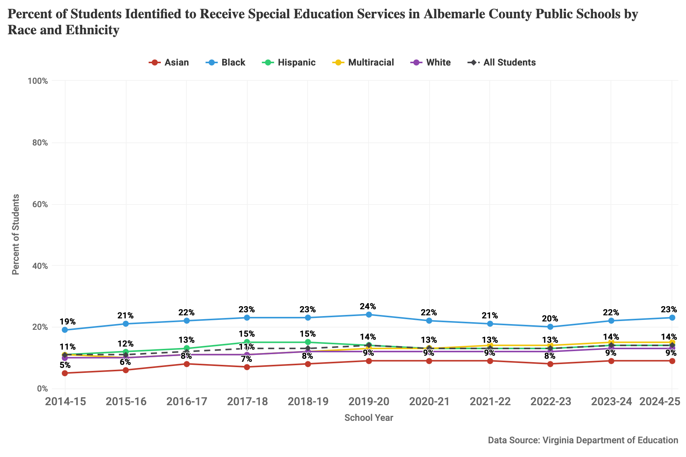
```

#### Charlottesville City Schools
```{r}
#| label: fig-cville-sped-img
#| fig-cap: "Percent of students identified to receive special education services by race and ethnicity for the 2014-15 through 2024-25 school years at CCS."

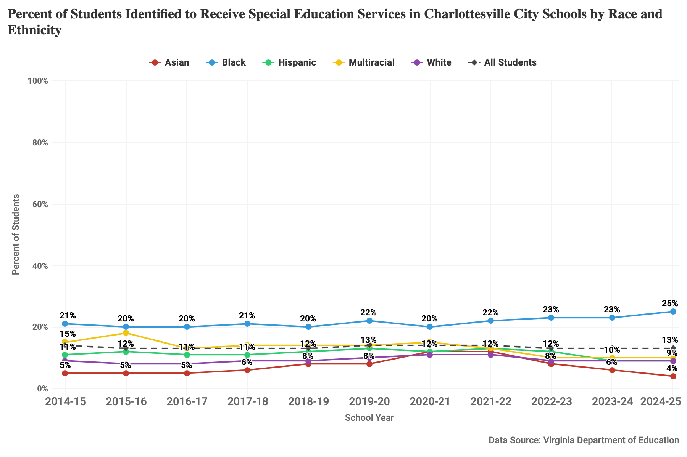
```

#### Virginia Public Schools
```{r}
#| label: fig-va-sped-img
#| fig-cap: "Percent of students identified to receive special education services by race and ethnicity for the 2014-15 through 2024-25 school years at Virginia public schools."

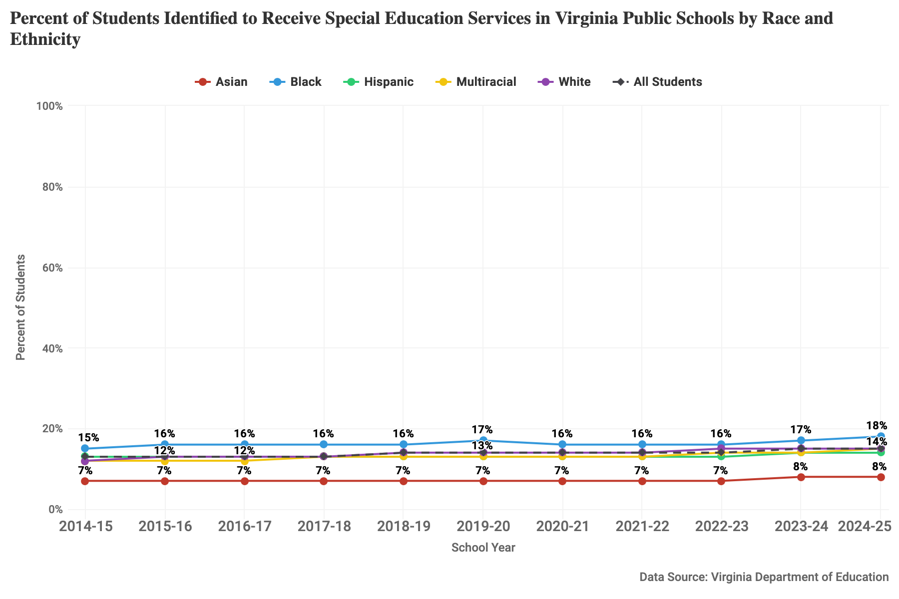
```
:::

### High School Graduation Rate

::: {.content-visible when-format="html"}
```{r include=FALSE}
# Init Step to make sure that the dependencies are loaded
highchart()
```

```{r, results='asis'}
#| label: fig-grad-rates
#| fig-cap: "Percent of student cohort graduating in four years by race and ethnicity, and economically disadvantaged students for 2014-2025 at ACPS, CCS and Virginia public schools."

df <- read_csv("../data/graduation_rates_race_econ_disadvan.csv") %>% 
  select(cohort_year, division_name, group, graduation_rate, students_in_cohort)

df_all <- read_csv("../data/graduation_rates.csv") %>% 
  mutate(group = "All Students", .after = "division_name") %>% 
  select(cohort_year, division_name, group, graduation_rate, students_in_cohort)

df <- rbind(df, df_all)

df <- df %>% 
  filter(! group %in% c("American Indian or Alaska Native", "Native Hawaiian  or Pacific Islander")) %>% 
  mutate(division_name = case_when(str_detect(division_name, "Albemarle") ~ "Albemarle County Public Schools", 
                                                        str_detect(division_name, "Charlottesville") ~ "Charlottesville City Schools",
                                                        str_detect(division_name, "Virginia") ~ "Virginia Public Schools"),
         label = case_when(group == "Black, not of Hispanic origin" ~ "Black",
                           group == "Non-Hispanic, two or more races" ~ "Multiracial",
                           group == "White, not of Hispanic origin" ~ "White",
                           .default = group)) %>% 
  filter(cohort_year >= 2014)

df$percent <- round(df$graduation_rate,0)
df$label <- df$label 
df$count_label <- prettyNum(df$students_in_cohort, big.mark = ",")

title <- "Percent of Student Cohort Graduating in Four Years"
ytext <- "Percent of Student Cohort"
xtext <- "Graduation Year"
xlabels <- JS("function() { return this.value; }")
source_text <- "Data Source: Virginia Department of Education"

nms <- unique(df$division_name)
len <- length(unique(df$division_name))

mychart <- function(i) {
  df <- df %>% filter(group != "Economically Disadvantaged")
  df_groups <- df %>% filter(group != "All Students")
  df_all <- df %>% filter(group == "All Students")
  
  df_groups %>%
    filter(df_groups$division_name == nms[[i]]) %>%
    hchart("line", hcaes(y = percent, x = cohort_year, group = label)) %>%
    hc_legend(align = "center", verticalAlign = "top") %>%
    hc_xAxis(title = list(text = xtext),
             labels = list(formatter = xlabels, style = list(fontSize = '1.2em')),
             tickInterval = 1,
             allowDecimals = FALSE) %>%
    hc_yAxis(min = 0, max = 100,
             title = list(text = ytext),
             labels = list(format = '{text}%')) %>%
  hc_colors(six_pal) %>%
  hc_plotOptions(series = list(dataLabels = list(format = '{y: f}%', enabled = TRUE)),
                 line = list( marker = list(enabled = TRUE, symbol = list("circle")) )) %>%
  hc_tooltip(formatter = JS("function(){
  return this.series.name + '</br><b>' + this.key + '</b></br>' + 'Percent: <b>' + this.y + '%</b></br>' + 'Est. Number: <b>' + this.point.count_label 
  }")) %>%
  hc_title(text = paste0(title, " in ", nms[[i]], " by Race and Ethnicity"),
           align = 'left') %>%
  hc_caption(text = source_text,
             align = "right",
             style = list(fontSize = '1em')) %>%
  hc_add_theme(hc_theme_smpl()) %>%
  hc_add_series(data =  df_all %>% filter(df_all$division_name == nms[[i]]), type = "line", mapping = hcaes(x = cohort_year, y = percent, group = label), dashStyle = "dash", marker = list(symbol = "diamond")) %>%
  hc_exporting(enabled=TRUE,
               sourceWidth = 900,
               sourceHeight = 600)
}

chart_disadvan <- function(i) {
  df <- df %>% filter(group %in% c("Economically Disadvantaged", "All Students"))
  df_groups <- df %>% filter(group != "All Students")
  df_all <- df %>% filter(group == "All Students")
  
  df_groups %>%
    filter(df_groups$division_name == nms[[i]]) %>%
    hchart("line", hcaes(y = percent, x = cohort_year, group = label)) %>%
    hc_legend(align = "center", verticalAlign = "top") %>%
    hc_xAxis(title = list(text = xtext),
             labels = list(formatter = xlabels, style = list(fontSize = '1.2em')),
             tickInterval = 1,
             allowDecimals = FALSE) %>%
    hc_yAxis(min = 0, max = 100,
             title = list(text = ytext),
             labels = list(format = '{text}%')) %>%
  hc_colors(c("#193CBC","#434348")) %>%
  hc_plotOptions(series = list(dataLabels = list(format = '{y: f}%', enabled = TRUE)),
                 line = list( marker = list(enabled = TRUE, symbol = list("circle")) )) %>%
  hc_tooltip(formatter = JS("function(){
  return this.series.name + '</br><b>' + this.key + '</b></br>' + 'Percent: <b>' + this.y + '%</b></br>' + 'Est. Number: <b>' + this.point.count_label 
  }")) %>%
  hc_title(text = paste0(title, " in ", nms[[i]], " by Economically Disadvantaged"),
           align = 'left') %>%
  hc_caption(text = source_text,
             align = "right",
             style = list(fontSize = '1em')) %>%
  hc_add_theme(hc_theme_smpl()) %>%
  hc_add_series(data =  df_all %>% filter(df_all$division_name == nms[[i]]), type = "line", mapping = hcaes(x = cohort_year, y = percent, group = label), dashStyle = "dash", marker = list(symbol = "diamond")) %>%
  hc_exporting(enabled=TRUE,
               sourceWidth = 900,
               sourceHeight = 600)
}

for (i in 1:len) {
  cat("####", nms[i], "\n \n")
  print(htmltools::tagList(mychart(i)))
  print(htmltools::tagList(chart_disadvan(i)))
}

```
:::

::: {.content-hidden when-format="html"}
#### Albemarle County Public Schools
```{r}
#| label: fig-alb-grad-rates-img
#| fig-cap: "Percent of student cohort graduating in four years by race and ethnicity, and economically disadvantaged students for 2014-2025 at ACPS."

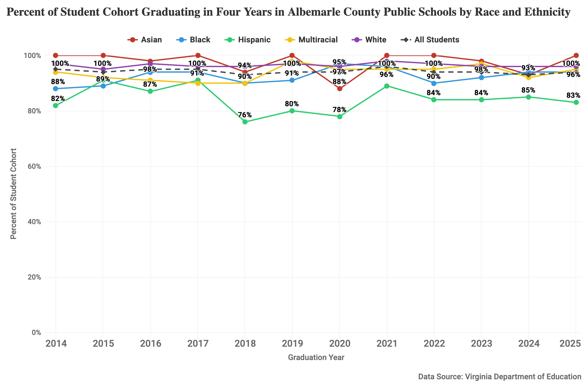
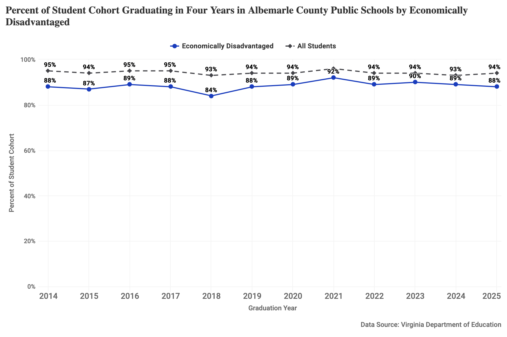
```

#### Charlottesville City Schools
```{r}
#| label: fig-cville-grad-rates-img
#| fig-cap: "Percent of student cohort graduating in four years by race and ethnicity, and economically disadvantaged students for 2014-2025 at CCS."

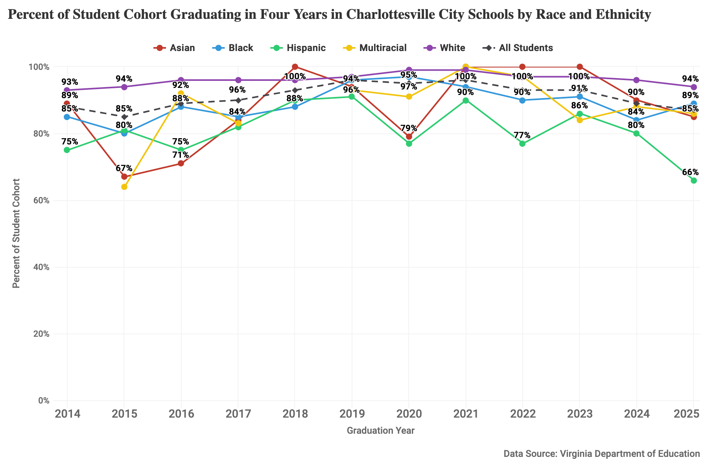
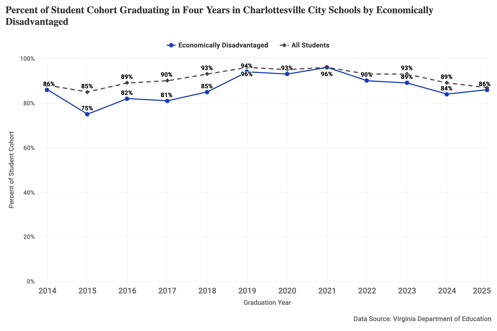
```

#### Virginia Public Schools
```{r}
#| label: fig-va-grad-rates-img
#| fig-cap: "Percent of student cohort graduating in four years by race and ethnicity, and economically disadvantaged students for 2014-2025 at Virginia public schools."

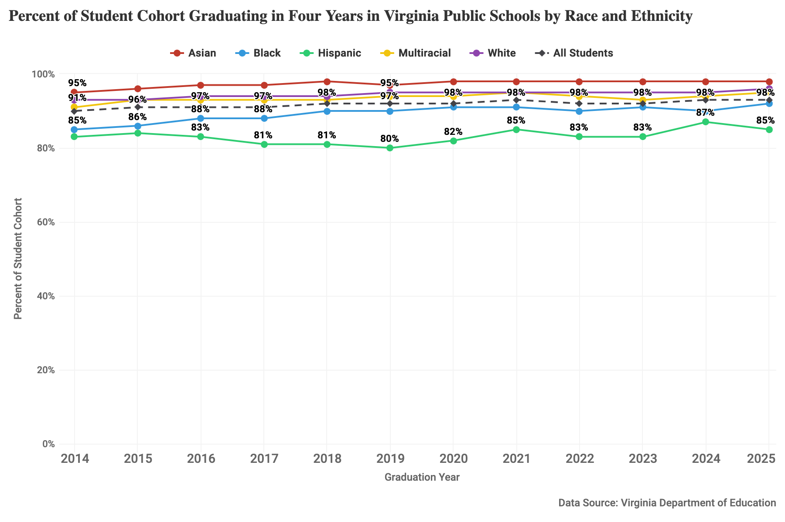
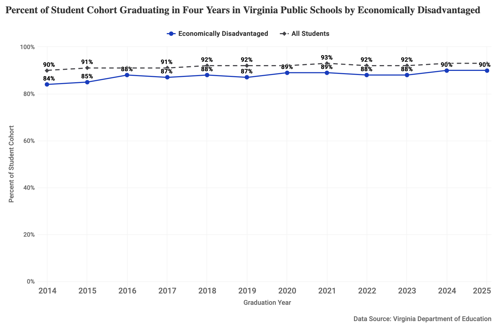
```
:::

### Post-Secondary Enrollment

::: {.content-visible when-format="html"}
```{r, results='asis'}
df <- read_csv("../data/postsecond_education_race_econ_disadvan.csv") %>% 
  filter(! group %in% c("American Indian", "Native Hawaiian", "Female", "Male", "Limited English Proficient Students", "Students with Disabilities")) %>% 
  mutate(division_name = case_when(str_detect(locality, "Albemarle") ~ "Albemarle County Public Schools", 
                                                        str_detect(locality, "Charlottesville") ~ "Charlottesville City Schools",
                                                        str_detect(locality, "Virginia") ~ "Virginia Public Schools"),
         label = case_when(group == "2 or More" ~ "Multiracial",
                           .default = group)) %>% 
  filter(year >= 2014) %>% 
  arrange(locality)

df$percent <- round(df$percentany,0)
df$label <- df$label 
df$count_label <- prettyNum(df$enrolledany, big.mark = ",")

title <- "Percent of Graduating Students Enrolled in a Post-Secondary Institution"
ytext <- "Percent of Graduating Students"
xtext <- "Graduation Year"
xlabels <- JS("function() { return this.value; }")
source_text <- "Data Source: Virginia Department of Education"

nms <- unique(df$division_name)
len <- length(unique(df$division_name))

mychart <- function(i) {
  df <- df %>% filter(group != "Economically Disadvantaged")
  df_groups <- df %>% filter(group != "All Students")
  df_all <- df %>% filter(group == "All Students")
  
  df_groups %>%
    filter(df_groups$division_name == nms[[i]]) %>%
    hchart("line", hcaes(y = percent, x = year, group = label)) %>%
    hc_legend(align = "center", verticalAlign = "top") %>%
    hc_xAxis(title = list(text = xtext),
             labels = list(formatter = xlabels, style = list(fontSize = '1.2em')),
             tickInterval = 1,
             allowDecimals = FALSE) %>%
    hc_yAxis(min = 0, max = 100,
             title = list(text = ytext),
             labels = list(format = '{text}%')) %>%
  hc_colors(six_pal) %>%
  hc_plotOptions(series = list(dataLabels = list(format = '{y: f}%', enabled = TRUE)),
                 line = list( marker = list(enabled = TRUE, symbol = list("circle")) )) %>%
  hc_tooltip(formatter = JS("function(){
  return this.series.name + '</br><b>' + this.key + '</b></br>' + 'Percent: <b>' + this.y + '%</b></br>' + 'Est. Number: <b>' + this.point.count_label 
  }")) %>%
  hc_title(text = paste0(title, " in ", nms[[i]], " by Race and Ethnicity"),
           align = 'left') %>%
  hc_caption(text = source_text,
             align = "right",
             style = list(fontSize = '1em')) %>%
  hc_add_theme(hc_theme_smpl()) %>%
  hc_add_series(data =  df_all %>% filter(df_all$division_name == nms[[i]]), type = "line", mapping = hcaes(x = year, y = percent, group = label), dashStyle = "dash", marker = list(symbol = "diamond")) %>%
  hc_exporting(enabled=TRUE,
               sourceWidth = 900,
               sourceHeight = 600)
}

chart_disadvan <- function(i) {
  df <- df %>% filter(group %in% c("Economically Disadvantaged","All Students")) %>% arrange(division_name)
  df_groups <- df %>% filter(group != "All Students")
  df_all <- df %>% filter(group == "All Students")
  
  df_groups %>%
    filter(df_groups$division_name == nms[[i]]) %>%
    hchart("line", hcaes(y = percent, x = year, group = label)) %>%
    hc_legend(align = "center", verticalAlign = "top") %>%
    hc_xAxis(title = list(text = xtext),
             labels = list(formatter = xlabels, style = list(fontSize = '1.2em')),
             tickInterval = 1,
             allowDecimals = FALSE) %>%
    hc_yAxis(min = 0, max = 100,
             title = list(text = ytext),
             labels = list(format = '{text}%')) %>%
  hc_colors(c("#193CBC","#434348")) %>%
  hc_plotOptions(series = list(dataLabels = list(format = '{y: f}%', enabled = TRUE)),
                 line = list( marker = list(enabled = TRUE, symbol = list("circle")) )) %>%
  hc_tooltip(formatter = JS("function(){
  return this.series.name + '</br><b>' + this.key + '</b></br>' + 'Percent: <b>' + this.y + '%</b></br>' + 'Est. Number: <b>' + this.point.count_label 
  }")) %>%
  hc_title(text = paste0(title, " in ", nms[[i]], " by Economically Disadvantaged"),
           align = 'left') %>%
  hc_caption(text = source_text,
             align = "right",
             style = list(fontSize = '1em')) %>%
  hc_add_theme(hc_theme_smpl()) %>%
  hc_add_series(data =  df_all %>% filter(df_all$division_name == nms[[i]]), type = "line", mapping = hcaes(x = year, y = percent, group = label), dashStyle = "dash", marker = list(symbol = "diamond")) %>%
  hc_exporting(enabled=TRUE,
               sourceWidth = 900,
               sourceHeight = 600)
}

for (i in 1:len) {
  cat("####", nms[i], "\n \n")
  print(htmltools::tagList(mychart(i)))
  print(htmltools::tagList(chart_disadvan(i)))
}

```
:::

::: {.content-hidden when-format="html"}
#### Albemarle County Public Schools
```{r}
#| label: fig-alb-postsecondary-img
#| fig-cap: "Percent of graduating students enrolled in a post-secondary institution by race and ethnicity, and economically disadvantaged students for 2014-2023 at ACPS."

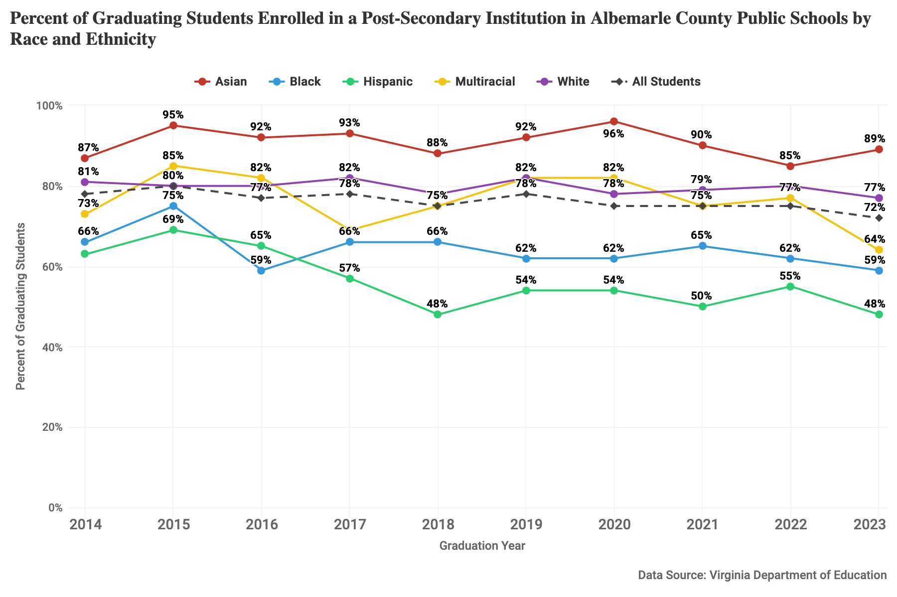
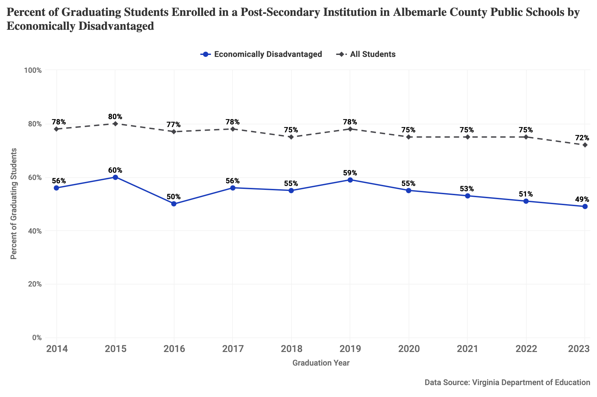
```

#### Charlottesville City Schools
```{r}
#| label: fig-cville-postsecondary-img
#| fig-cap: "Percent of graduating students enrolled in a post-secondary institution by race and ethnicity, and economically disadvantaged students for 2014-2023 at CCS."

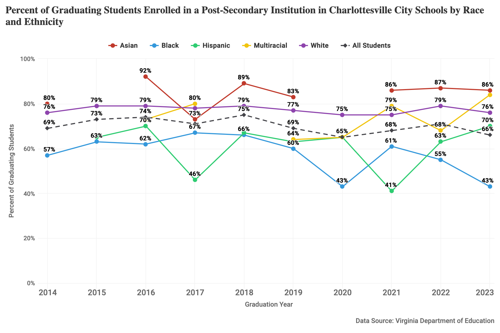
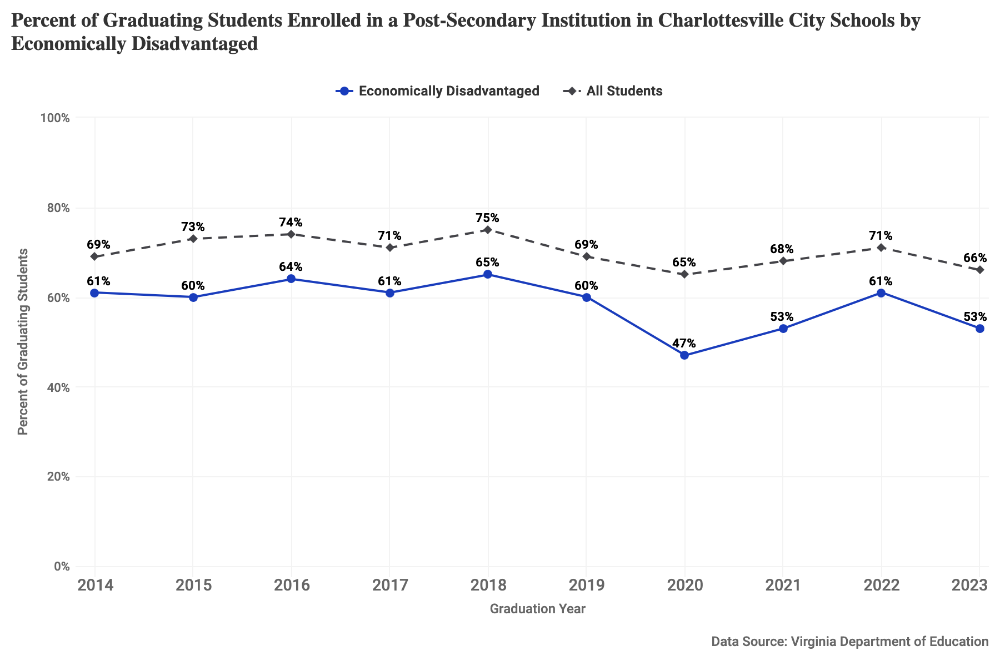
```

#### Virginia Public Schools
```{r}
#| label: fig-va-postsecondary-img
#| fig-cap: "Percent of graduating students enrolled in a post-secondary institution by race and ethnicity, and economically disadvantaged students for 2014-2023 at Virginia public schools."

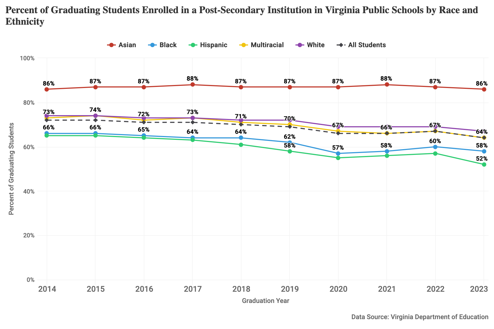
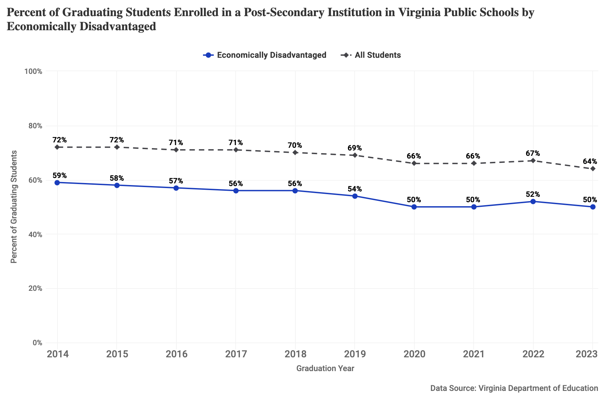
```
:::

## Economic and Family Stability

### Youth Labor Force Participation and Unemployment
```{r}
library(ggspatial)
library(ggthemes)
library(patchwork)

df <- read_csv("../data/youth_employment_status_by_tract.csv") %>% 
  filter(year >= 2020) %>% 
  rename(laborforce_count = laborforce_16_19yr,
         unemployed_count = unemployed_16_19yr,
         laborforce_percent = per_laborforce_16_19yr,
         unemployed_percent = per_unemployed_16_19yr) %>% 
  pivot_longer(laborforce_count:unemployed_percent, names_to = c("variable", ".value"), 
               names_sep="_") %>% 
  mutate(variable = ifelse(variable == "laborforce", "Youth (16-19) Participating in the Labor Force", "Youth (16-19) in the Labor Force Experiencing Unemployment"))
  
```

#### Albemarle County Census Tracts
```{r}
# Set data
df_alb <- df %>% 
  filter(year >= 2020) %>% 
  filter(locality == "Albemarle")

df_alb$percent <- round(df_alb$percent,0)
df_alb$label <- df_alb$tractnames 
df_alb$count_label <- prettyNum(df_alb$count, big.mark = ",")

title <- "Percent of Youth (16-19) Participating in the Labor Force by Census Tract"
ytext <- "Percent of Youth (16-19)"
xtext <- "Year"
xlabels <- JS("function() { return this.value; }")
source_text <- "Data Source: U.S. Census Bureau, American Community Survey 5-year estimates"

```

:::{.content-visible when-format="html" .column-body layout-ncol=2}
```{r}
youth_employ_map <- df_alb %>% 
  mutate(GEOID = as.character(GEOID)) %>% 
  filter(year == 2024) %>% 
  left_join(tracts_geo, by = join_by(GEOID == GEOID)) %>%
  st_as_sf()

map_laborforce <- youth_employ_map %>% filter(variable == "Youth (16-19) Participating in the Labor Force")

leaflet() %>% 
  addProviderTiles("CartoDB.Positron") %>% 
  addPolygons(data = map_laborforce,
              fillColor = ~pal_red(map_laborforce$percent),
              weight = 1,
              opacity = 1,
              color = "white", 
              fillOpacity = 0.7,
              popup = paste0("Place: ", map_laborforce$tractnames, "<br>",
                             "Census Tract: ", map_laborforce$NAME.x, "<br>",
                             "Percent: ", map_laborforce$percent, "%")) %>%
  addLegend("topright", pal = pal_red_rev, values = map_laborforce$percent, 
            title = "Youth in the<br/>Labor Force<br/>(2024)", opacity = 0.7,
            # labFormat = labelFormat(transform = function(x) sort(x, decreasing = TRUE), suffix = "%"),
            labFormat = function(type, breaks) {
              return(c("80 - 100%", "60 - 80%", "40 - 60%", "20 - 40%", "0 - 20%"))
            })
```

```{r}
map_unemploy <- youth_employ_map %>% filter(variable == "Youth (16-19) in the Labor Force Experiencing Unemployment")
leaflet() %>% 
  addProviderTiles("CartoDB.Positron") %>% 
  addPolygons(data = map_unemploy,
              fillColor = ~pal_blue(map_unemploy$percent),
              weight = 1,
              opacity = 1,
              color = "white", 
              fillOpacity = 0.7,
              popup = paste0("Place: ", map_unemploy$tractnames, "<br>",
                             "Census Tract: ", map_unemploy$NAME.x, "<br>",
                             "Percent: ", map_unemploy$percent, "%")) %>%
  addLegend("topright", pal = pal_blue_rev, values = map_unemploy$percent, 
            title = "Unemployed Youth<br/>in the Labor Force<br/>(2024)", opacity = 0.7,
            # labFormat = labelFormat(transform = function(x) sort(x, decreasing = TRUE), suffix = "%"),
            labFormat = function(type, breaks) {
              return(c("80 - 100%", "60 - 80%", "40 - 60%", "20 - 40%", "0 - 20%"))
            }
            )
```
:::

::: {.content-hidden when-format="html"}
```{r, fig.width=12, fig.height=10.25}
#| label: fig-youth-employ-alb
#| fig-cap: "Percent of youth (16-19) participating in the labor force by census tract, 2024, for Albemarle County."

# Geospatial visualization ----
pal_labor <- carto_pal(7, "RedOr")

alb_labor_map <- map_laborforce %>%
  mutate(text = paste0(round(percent,0), "%")) %>%
  ggplot() +
  annotation_map_tile(zoomin = 1, progress = "none", cachedir = "../data/tempdata/") +
  geom_sf(aes(fill = round(percent,0)), color = "white") +
  geom_sf_text(aes(label = text), size = 3.25, color = "black") +
  scale_fill_stepsn(colors = pal_labor,
                    labels = scales::label_percent(scale = 1),
                    n.breaks = 6,
                    guide = guide_colourbar(title = "Percent Youth in Labor Force",
                                            title.position = "top",
                                            direction = "horizontal",
                                            title.hjust = 0.5,
                                            # nbin = 6,
                                            theme = theme(legend.key.height  = unit(0.5, "lines"),
                                                          legend.key.width = unit(12, "lines"),
                                                          text = element_text(size = 11)) 
                                            )
                    )+
  theme_map()+
  theme(legend.position.inside=c(1, 1.04),
        legend.justification="right",
        plot.title = element_text(size = 14),
        plot.subtitle = element_text(size = 14))


# Gap chart ----
alb_labor <- map_laborforce %>%
  group_by(percent) %>%
  summarise(tractnames = paste(tractnames, collapse = "; ")) %>%
  na.exclude()

names <- alb_labor$tractnames
labor <- alb_labor$percent

alb_labor_gap <-  ggplot(alb_labor, aes(x = 0, y = percent, label = names)) +
    geom_line(color = "grey", size = 1)+
    geom_point(aes(color=as.factor(percent)), size=5)+
    geom_text(label = str_wrap(names, width = 60), hjust = 0, nudge_x = 0.005,
              nudge_y = case_when(alb_labor$percent %in% c(3,4) ~ 0.2,
                                  alb_labor$percent %in% c(0,1,2) ~ -0.1,
                             .default = 0.01),
              # nudge_y = .05,
              size = 3.5,
              # angle=55,
              lineheight = 0.7) +
   scale_color_carto_d(name = "Percent Youth in the Labor Force: ",
                           type = "diverging", palette = "RedOr", direction = 1) +
    scale_x_continuous(limits = c(0,.1),
                       expand = c(0.03, 0))+
    scale_y_continuous(breaks = labor,
                       labels = paste0(labor,"%")
                       ) +
  theme_minimal()+
    theme(axis.line.x = element_blank(),
          axis.ticks.x = element_blank(),
          axis.text.x = element_blank(),
          axis.title.x = element_blank(),
          axis.title.y = element_blank(),
          panel.grid.minor = element_blank(),
          panel.grid.major = element_blank(),
          axis.text.y = element_text(size = 11),
          axis.ticks = element_line(linewidth = .5),
          axis.ticks.length.y = unit(.25, "cm"),
          plot.title.position= "plot",
          plot.caption.position = "plot",
          plot.caption = element_text(hjust = 0),
          legend.position="none")

  (alb_labor_map + patchwork::free(alb_labor_gap)) +
  plot_layout(widths = c(1.75, 1)) +
  plot_annotation(title = title,
                  subtitle = "Albemarle County",
                  caption = source_text,
                  theme = theme(plot.title = element_text(size = 18),
                                plot.subtitle = element_text(size = 16),
                                plot.caption = element_text(size = 14)))
```

```{r, fig.width=12, fig.height=10.25}
#| label: fig-youth-unemploy-alb
#| fig-cap: "Percent of youth (16-19) in the labor force experiencing unemployment by census tract, 2024, for Albemarle County."
# Geospatial visualization ----
pal_unemploy <- carto_pal(7, "Teal")

alb_unemploy_map <- map_unemploy %>%
  mutate(text = paste0(round(percent,0), "%")) %>%
  ggplot() +
  annotation_map_tile(zoomin = 1, progress = "none", cachedir = "../data/tempdata/") +
  geom_sf(aes(fill = round(percent,0)), color = "white") +
  geom_sf_text(aes(label = text), size = 3.25, color = "black") +
  scale_fill_stepsn(colors = pal_unemploy,
                    labels = scales::label_percent(scale = 1),
                    n.breaks = 6,
                    guide = guide_colourbar(title = "Percent Youth Unemployed",
                                            title.position = "top",
                                            direction = "horizontal",
                                            title.hjust = 0.5,
                                            # nbin = 6,
                                            theme = theme(legend.key.height  = unit(0.5, "lines"),
                                                          legend.key.width = unit(12, "lines"),
                                                          text = element_text(size = 11)) 
                                            )
                    )+
  theme_map()+
  theme(legend.position.inside=c(1, 1.04),
        legend.justification="right",
        plot.title = element_text(size = 14),
        plot.subtitle = element_text(size = 14))


# Gap chart ----
alb_unemploy <- map_unemploy %>%
  group_by(percent) %>%
  summarise(tractnames = paste(tractnames, collapse = "; ")) %>%
  na.exclude()

names <- alb_unemploy$tractnames
unemploy <- alb_unemploy$percent

alb_unemploy_gap <-  ggplot(alb_unemploy, aes(x = 0, y = percent, label = names)) +
    geom_line(color = "grey", size = 1)+
    geom_point(aes(color=as.factor(percent)), size=5)+
    geom_text(label = str_wrap(names, width = 60), hjust = 0, nudge_x = 0.005,
              nudge_y = case_when(alb_unemploy$percent %in% c(5,8) ~ 0.4,
                                  alb_unemploy$percent %in% c(0) ~ -0.5,
                             .default = 0.01),
              # nudge_y = .05,
              size = 3.5,
              # angle=55,
              lineheight = 0.7) +
   scale_color_carto_d(name = "Percent Youth Unemployed: ",
                           type = "diverging", palette = "Teal", direction = 1) +
    scale_x_continuous(limits = c(0,.1),
                       expand = c(0.03, 0))+
    scale_y_continuous(breaks = unemploy,
                       labels = paste0(unemploy,"%")
                       ) +
  theme_minimal()+
    theme(axis.line.x = element_blank(),
          axis.ticks.x = element_blank(),
          axis.text.x = element_blank(),
          axis.title.x = element_blank(),
          axis.title.y = element_blank(),
          panel.grid.minor = element_blank(),
          panel.grid.major = element_blank(),
          axis.text.y = element_text(size = 11),
          axis.ticks = element_line(linewidth = .5),
          axis.ticks.length.y = unit(.25, "cm"),
          plot.title.position= "plot",
          plot.caption.position = "plot",
          plot.caption = element_text(hjust = 0),
          legend.position="none")

  (alb_unemploy_map + patchwork::free(alb_unemploy_gap)) +
  plot_layout(widths = c(1.75, 1)) +
  plot_annotation(title = "Percent of Youth (16-19) Experiencing Unemployment by Census Tract",
                  subtitle = "Albemarle County",
                  caption = source_text,
                  theme = theme(plot.title = element_text(size = 18),
                                plot.subtitle = element_text(size = 16),
                                plot.caption = element_text(size = 14)))
```
:::

::: {.content-visible when-format="html"}
#### Albemarle Census Tracts: Youth in the Labor Force and Unemployment 2020-2024
```{r include=FALSE}
# Init Step to make sure that the dependencies are loaded
highchart()
```

::: {.panel-tabset .nav-pills style="display: flex;"}
```{r, results='asis'}

nms <- unique(df_alb$tractnames)
len <- length(unique(df_alb$tractnames))

mychart <- function(i) {
   
  df_alb_laborforce <- df_alb %>% filter(variable == "Youth (16-19) Participating in the Labor Force")
  df_alb_unemployed <- df_alb %>% filter(variable == "Youth (16-19) in the Labor Force Experiencing Unemployment")
  
 df_alb_laborforce %>%
    filter(df_alb_laborforce$tractnames == nms[[i]]) %>%
    hchart("line", hcaes(y = percent, x = year, group = variable)) %>% 
    hc_legend(align = "center", verticalAlign = "top") %>%
    hc_xAxis(title = list(text = "Year"),
             labels = list(formatter = xlabels, style = list(fontSize = '1.2em')),
             tickInterval = 1,
             allowDecimals = FALSE) %>%
    hc_yAxis(min = 0, max = 100,
             title = list(text = "Percent"),
             labels = list(format = '{text}%')) %>%
  hc_colors(two_pal) %>%
  hc_plotOptions(series = list(dataLabels = list(format = '{y: f}%', enabled = TRUE)),
                 line = list( marker = list(enabled = TRUE) )) %>%
  hc_tooltip(formatter = JS("function(){
  return this.series.name + '</br><b>' + this.key + '</b></br>' + 'Percent: <b>' + this.y + '%</b></br>' + 'Est. Number: <b>' + this.point.count_label + '</b>'
  }")) %>%
  hc_title(text = nms[[i]],
           align = 'left') %>%
  hc_add_theme(hc_theme_smpl()) %>% 
  hc_add_series(data =  df_alb_unemployed %>% filter(df_alb_unemployed$tractnames == nms[[i]]), type = "line", mapping = hcaes(x = year, y = percent, group = variable)) %>%
  hc_exporting(enabled=TRUE,
               sourceWidth = 900,
               sourceHeight = 600)
}

for (i in 1:len) {
  cat("####", nms[i], "\n \n")
  print(htmltools::tagList(mychart(i)))
}

```
:::

:::


#### Charlottesville Census Tracts
```{r}
# Set data
df_cville <- df %>% 
  filter(year >= 2020) %>% 
  filter(locality == "Charlottesville")

df_cville$percent <- round(df_cville$percent,0)
df_cville$label <- df_cville$tractnames 
df_cville$count_label <- prettyNum(df_cville$count, big.mark = ",")

title <- "Percent of Youth (16-19) Participating in the Labor Force by Census Tract"
ytext <- "Percent of Youth (16-19)"
xtext <- "Year"
xlabels <- JS("function() { return this.value; }")
source_text <- "Data Source: U.S. Census Bureau, American Community Survey 5-year estimates"

```

:::{.content-visible when-format="html" .column-body layout-ncol=2}
```{r}
youth_employ_map <- df_cville %>% 
  mutate(GEOID = as.character(GEOID)) %>% 
  filter(year == 2024) %>% 
  left_join(tracts_geo, by = join_by(GEOID == GEOID)) %>%
  st_as_sf()

map_laborforce <- youth_employ_map %>% filter(variable == "Youth (16-19) Participating in the Labor Force")

leaflet() %>% 
  addProviderTiles("CartoDB.Positron") %>% 
  addPolygons(data = map_laborforce,
              fillColor = ~pal_red(map_laborforce$percent),
              weight = 1,
              opacity = 1,
              color = "white", 
              fillOpacity = 0.7,
              popup = paste0("Place: ", map_laborforce$tractnames, "<br>",
                             "Census Tract: ", map_laborforce$NAME.x, "<br>",
                             "Percent: ", map_laborforce$percent, "%")) %>%
  addLegend("topright", pal = pal_red_rev, values = map_laborforce$percent, 
            title = "Youth in the<br/>Labor Force<br/>(2024)", opacity = 0.7,
            # labFormat = labelFormat(transform = function(x) sort(x, decreasing = TRUE), suffix = "%"),
            labFormat = function(type, breaks) {
              return(c("80 - 100%", "60 - 80%", "40 - 60%", "20 - 40%", "0 - 20%"))
            }
            )
```
```{r}
map_unemploy <- youth_employ_map %>% filter(variable == "Youth (16-19) in the Labor Force Experiencing Unemployment")
leaflet() %>% 
  addProviderTiles("CartoDB.Positron") %>% 
  addPolygons(data = map_unemploy,
              fillColor = ~pal_blue(map_unemploy$percent),
              weight = 1,
              opacity = 1,
              color = "white", 
              fillOpacity = 0.7,
              popup = paste0("Place: ", map_unemploy$tractnames, "<br>",
                             "Census Tract: ", map_unemploy$NAME.x, "<br>",
                             "Percent: ", map_unemploy$percent, "%")) %>%
  addLegend("topright", pal = pal_blue_rev, values = map_unemploy$percent, 
            title = "Unemployed Youth<br/>in the Labor Force<br/>(2024)", opacity = 0.7,
            # labFormat = labelFormat(transform = function(x) sort(x, decreasing = FALSE), suffix = "%"),
            labFormat = function(type, breaks) {
              return(c("80 - 100%", "60 - 80%", "40 - 60%", "20 - 40%", "0 - 20%"))
            }
            )
```
:::

::: {.content-hidden when-format="html"}
```{r, fig.width=9, fig.height=7}
#| label: fig-youth-employ-cville
#| fig-cap: "Percent of youth (16-19) participating in the labor force by census tract, 2024, for Charlottesville City."
# Geospatial visualization ----
pal_labor <- carto_pal(7, "RedOr")

cville_labor_map <- map_laborforce %>%
  mutate(text = paste0(round(percent,0), "%")) %>%
  ggplot() +
  annotation_map_tile(zoomin = 1, progress = "none", cachedir = "../data/tempdata/") +
  geom_sf(aes(fill = round(percent,0)), color = "white") +
  geom_sf_text(aes(label = text), size = 3.25, color = "black") +
  scale_fill_stepsn(colors = pal_labor,
                    labels = scales::label_percent(scale = 1),
                    n.breaks = 6,
                    guide = guide_colourbar(title = "Percent Youth in Labor Force",
                                            title.position = "top",
                                            direction = "horizontal",
                                            title.hjust = 0.5,
                                            # nbin = 6,
                                            theme = theme(legend.key.height  = unit(0.5, "lines"),
                                                          legend.key.width = unit(12, "lines"),
                                                          text = element_text(size = 11)) 
                                            )
                    )+
  theme_map()+
  theme(legend.position.inside=c(1, 1.06),
        legend.justification="right",
        plot.title = element_text(size = 14),
        plot.subtitle = element_text(size = 14))


# Gap chart ----
cville_labor <- map_laborforce %>%
  group_by(percent) %>%
  summarise(tractnames = paste(tractnames, collapse = "; ")) %>%
  na.exclude()

names <- cville_labor$tractnames
labor <- cville_labor$percent

cville_labor_gap <-  ggplot(cville_labor, aes(x = 0, y = percent, label = names)) +
    geom_line(color = "grey", size = 1)+
    geom_point(aes(color=as.factor(percent)), size=5)+
    geom_text(label = str_wrap(names, width = 60), hjust = 0, nudge_x = 0.005,
              nudge_y = case_when(cville_labor$percent %in% c(3,4) ~ 0.2,
                                  cville_labor$percent %in% c(0,1,2) ~ -0.1,
                             .default = 0.01),
              # nudge_y = .05,
              size = 3.5,
              # angle=55,
              lineheight = 0.7) +
   scale_color_carto_d(name = "Percent Youth in the Labor Force: ",
                           type = "diverging", palette = "RedOr", direction = 1) +
    scale_x_continuous(limits = c(0,.1),
                       expand = c(0.03, 0))+
    scale_y_continuous(breaks = labor,
                       labels = paste0(labor,"%")
                       ) +
  theme_minimal()+
   theme(axis.line.x = element_blank(),
          axis.ticks.x = element_blank(),
          axis.text.x = element_blank(),
          axis.title.x = element_blank(),
          axis.title.y = element_blank(),
          panel.grid.minor = element_blank(),
          panel.grid.major = element_blank(),
          axis.text.y = element_text(size = 11),
          axis.ticks = element_line(linewidth = .5),
          axis.ticks.length.y = unit(.25, "cm"),
          plot.title.position= "plot",
          plot.caption.position = "plot",
          plot.caption = element_text(hjust = 0),
          legend.position="none")

  (cville_labor_map + cville_labor_gap) +
  plot_layout(widths = c(2, 1)) +
  plot_annotation(title = title,
                  subtitle = "Charlottesville City",
                  caption = source_text,
                  theme = theme(plot.title = element_text(size = 18),
                                plot.subtitle = element_text(size = 16),
                                plot.caption = element_text(size = 14)))
```

```{r, fig.width=9, fig.height=7}
#| label: fig-youth-unemploy-cville
#| fig-cap: "Percent of youth (16-19) in the labor force experiencing unemployment by census tract, 2024, for Charlottesville City."
# Geospatial visualization ----
pal_unemploy <- carto_pal(7, "Teal")

cville_unemploy_map <- map_unemploy %>%
  mutate(text = paste0(round(percent,0), "%")) %>%
  ggplot() +
  annotation_map_tile(zoomin = 1, progress = "none", cachedir = "../data/tempdata/") +
  geom_sf(aes(fill = round(percent,0)), color = "white") +
  geom_sf_text(aes(label = text), size = 3.25, color = "black") +
  scale_fill_stepsn(colors = pal_unemploy,
                    labels = scales::label_percent(scale = 1),
                    n.breaks = 6,
                    guide = guide_colourbar(title = "Percent Youth Unemployed",
                                            title.position = "top",
                                            direction = "horizontal",
                                            title.hjust = 0.5,
                                            # nbin = 6,
                                            theme = theme(legend.key.height  = unit(0.5, "lines"),
                                                          legend.key.width = unit(12, "lines"),
                                                          text = element_text(size = 11)) 
                                            )
                    )+
  theme_map()+
  theme(legend.position.inside=c(1, 1.06),
        legend.justification="right",
        plot.title = element_text(size = 14),
        plot.subtitle = element_text(size = 14))


# Gap chart ----
cville_unemploy <- map_unemploy %>%
  group_by(percent) %>%
  summarise(tractnames = paste(tractnames, collapse = "; ")) %>%
  na.exclude()

names <- cville_unemploy$tractnames
unemploy <- cville_unemploy$percent

cville_unemploy_gap <-  ggplot(cville_unemploy, aes(x = 0, y = percent, label = names)) +
    geom_line(color = "grey", size = 1)+
    geom_point(aes(color=as.factor(percent)), size=5)+
    geom_text(label = str_wrap(names, width = 60), hjust = 0, nudge_x = 0.005,
              nudge_y = 0.01,
              # nudge_y = .05,
              size = 3.5,
              # angle=55,
              lineheight = 0.7) +
   scale_color_carto_d(name = "Percent Youth Unemployed: ",
                           type = "diverging", palette = "Teal", direction = 1) +
    scale_x_continuous(limits = c(0,.1),
                       expand = c(0.03, 0))+
    scale_y_continuous(breaks = unemploy,
                       labels = paste0(unemploy,"%")
                       ) +
  theme_minimal()+
  theme(axis.line.x = element_blank(),
          axis.ticks.x = element_blank(),
          axis.text.x = element_blank(),
          axis.title.x = element_blank(),
          axis.title.y = element_blank(),
          panel.grid.minor = element_blank(),
          panel.grid.major = element_blank(),
          axis.text.y = element_text(size = 11),
          axis.ticks = element_line(linewidth = .5),
          axis.ticks.length.y = unit(.25, "cm"),
          plot.title.position= "plot",
          plot.caption.position = "plot",
          plot.caption = element_text(hjust = 0),
          legend.position="none")

  (cville_unemploy_map + cville_unemploy_gap) +
  plot_layout(widths = c(2, 1)) +
  plot_annotation(title = "Percent of Youth (16-19) Experiencing Unemployment by Census Tract",
                  subtitle = "Charlottesville City",
                  caption = source_text,
                  theme = theme(plot.title = element_text(size = 18),
                                plot.subtitle = element_text(size = 16),
                                plot.caption = element_text(size = 14)))
```
:::

::: {.content-visible when-format="html"}
#### Charlottesville Census Tracts: Youth in the Labor Force and Unemployment 2020-2024
```{r include=FALSE}
# Init Step to make sure that the dependencies are loaded
highchart()
```

::: {.panel-tabset .nav-pills style="display: flex;"}
```{r, results='asis'}

nms <- unique(df_cville$tractnames)
len <- length(unique(df_cville$tractnames))

mychart <- function(i) {
   
  df_cville_laborforce <- df_cville %>% filter(variable == "Youth (16-19) Participating in the Labor Force")
  df_cville_unemployed <- df_cville %>% filter(variable == "Youth (16-19) in the Labor Force Experiencing Unemployment")
  
 df_cville_laborforce %>%
    filter(df_cville_laborforce$tractnames == nms[[i]]) %>%
    hchart("line", hcaes(y = percent, x = year, group = variable)) %>% 
    hc_legend(align = "center", verticalAlign = "top") %>%
    hc_xAxis(title = list(text = "Year"),
             labels = list(formatter = xlabels, style = list(fontSize = '1.2em')),
             tickInterval = 1,
             allowDecimals = FALSE) %>%
    hc_yAxis(min = 0, max = 100,
             title = list(text = "Percent"),
             labels = list(format = '{text}%')) %>%
  hc_colors(two_pal) %>%
  hc_plotOptions(series = list(dataLabels = list(format = '{y: f}%', enabled = TRUE)),
                 line = list( marker = list(enabled = TRUE) )) %>%
  hc_tooltip(formatter = JS("function(){
  return this.series.name + '</br><b>' + this.key + '</b></br>' + 'Percent: <b>' + this.y + '%</b></br>' + 'Est. Number: <b>' + this.point.count_label + '</b></br>Total Est. 16-19 yr olds: ' + this.point.total_16_19yr
  }")) %>%
  hc_title(text = nms[[i]],
           align = 'left') %>%
  hc_add_theme(hc_theme_smpl()) %>% 
  hc_add_series(data =  df_cville_unemployed %>% filter(df_cville_unemployed$tractnames == nms[[i]]), type = "line", mapping = hcaes(x = year, y = percent, group = variable)) %>%
  hc_exporting(enabled=TRUE,
               sourceWidth = 900,
               sourceHeight = 600)
}

for (i in 1:len) {
  cat("####", nms[i], "\n \n")
  print(htmltools::tagList(mychart(i)))
}

```
:::

:::

### Children Living below Poverty Threshold

::: {.content-visible when-format="html"}
```{r, results='asis'}

df <- read_csv("../data/child_poverty_by_race.csv") %>% 
  filter(year >= 2014) %>% 
  filter(! group %in% c("under18_white")) %>% 
  arrange(locality) %>% 
  mutate(label = case_when(group == "under18_asian" ~ "Asian",
                           group == "under18_black" ~ "Black",
                           group == "under18_multi" ~ "Multiracial",
                           group == "under18_white_nonhisp" ~ "White",
                           group == "under18_hisp" ~ "Hispanic",
                           group == "under18" ~ "All Children"))

df$percent <- round(df$pov_rate_bygroup,0)
df$label <- df$label 
df$count_label <- prettyNum(df$pov_num_group, big.mark = ",")

title <- "Percent of Children Living below the Poverty Threshold"
ytext <- "Percent of Children"
xtext <- "Year"
xlabels <- JS("function() { return this.value; }")
source_text <- "Data Source: U.S. Census Bureau, American Community Survey 5-year estimates"

nms <- unique(df$locality)
len <- length(unique(df$locality))

mychart <- function(i) {
   
  df_groups <- df %>% filter(label != "All Children")
  df_all <- df %>% filter(label == "All Children")
  
  df_groups %>%
    filter(df_groups$locality == nms[[i]]) %>%
    hchart("line", hcaes(y = percent, x = year, group = label)) %>%
    hc_legend(align = "center", verticalAlign = "top") %>%
    hc_xAxis(title = list(text = xtext),
             labels = list(formatter = xlabels, style = list(fontSize = '1.2em')),
             tickInterval = 1,
             allowDecimals = FALSE) %>%
    hc_yAxis(min = 0, max = 100,
             title = list(text = ytext),
             labels = list(format = '{text}%')) %>%
  hc_colors(six_pal) %>%
  hc_plotOptions(series = list(dataLabels = list(format = '{y: f}%', enabled = TRUE)),
                 line = list( marker = list(enabled = TRUE, symbol = list("circle")) )) %>%
  hc_tooltip(formatter = JS("function(){
  return this.series.name + '</br><b>' + this.key + '</b></br>' + 'Percent: <b>' + this.y + '%</b></br>' + 'Est. Number: <b>' + this.point.count_label + '</b></br>Total Est.: ' + this.point.population_num_group
  }")) %>%
  hc_title(text = paste0(title, " in ", nms[[i]], " by Race and Ethnicity"),
           align = 'left') %>%
  hc_caption(text = source_text,
             align = "right",
             style = list(fontSize = '1em')) %>%
  hc_add_theme(hc_theme_smpl()) %>%
  hc_add_series(data =  df_all %>% filter(df_all$locality == nms[[i]]), type = "line", mapping = hcaes(x = year, y = percent, group = label), dashStyle = "dash", marker = list(symbol = "diamond")) %>%
  hc_exporting(enabled=TRUE,
               sourceWidth = 900,
               sourceHeight = 600)
  
 
}

for (i in 1:len) {
  cat("####", nms[i], "\n \n")
  print(htmltools::tagList(mychart(i)))
}

```
:::

::: {.content-hidden when-format="html"}
#### Albemarle County
```{r}
#| label: fig-alb-child-pov-img
#| fig-cap: "Percent of children living below the poverty threshold by race and ethnicity, 2014-2024, for Albemarle County."

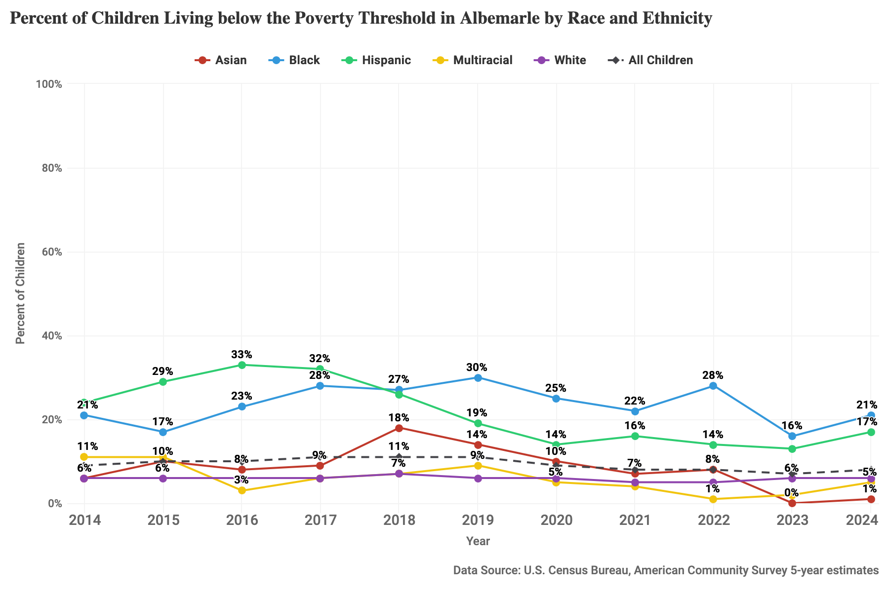
```

#### Charlottesville City
```{r}
#| label: fig-cville-child-pov-img
#| fig-cap: "Percent of children living below the poverty threshold by race and ethnicity, 2014-2024, for Charlottesville City."

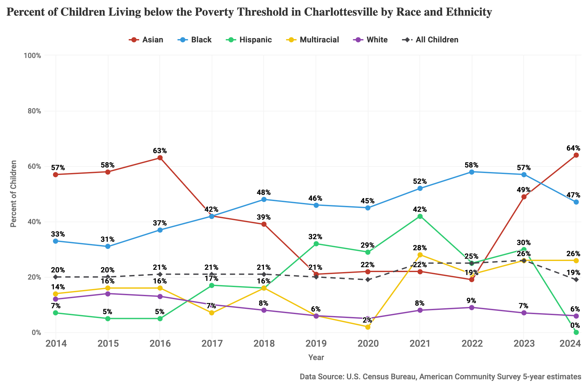
```

#### Virginia
```{r}
#| label: fig-va-child-pov-img
#| fig-cap: "Percent of children living below the poverty threshold by race and ethnicity, 2014-2024, for Virginia."

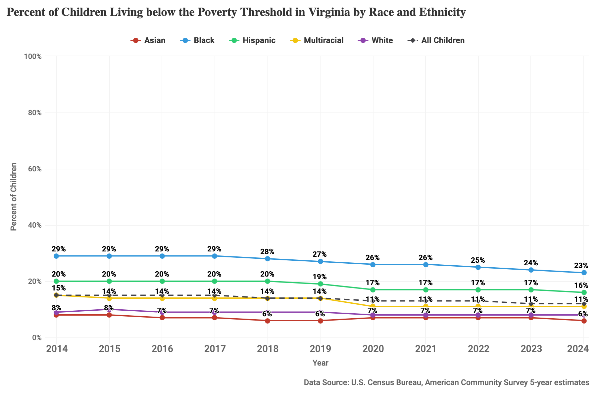
```
:::

### Students Identified as Economically Disadvantaged

::: {.content-visible when-format="html"}
```{r, results='asis'}
df <- read_csv("../data/econ_disadvan_students_by_race.csv") %>% 
  select(school_year, division_name, race, disadvan_race_count, disadvan_total_count, total_students, disadvan_percent_byrace)

df_all <- read_csv("../data/economically_disadvantaged_students.csv") %>% 
  mutate(race = "All Students", .after = "division_name") %>% 
  rename("disadvan_race_count" = "economically_disadvantaged_students",
         "disadvan_percent_byrace" = "percent_disadvantaged") %>% 
  mutate(disadvan_total_count = disadvan_race_count, .after = "disadvan_race_count") %>% 
  select(school_year, division_name, race, disadvan_race_count, disadvan_total_count, total_students, disadvan_percent_byrace)

df <- rbind(df, df_all)

df <- df %>%
  filter(! race %in% c("American Indian or Alaska Native", "Native Hawaiian  or Pacific Islander")) %>% 
  mutate(year = as.numeric(str_sub(school_year,1,4)),
         division_name = case_when(str_detect(division_name, "Albemarle") ~ "Albemarle County Public Schools", 
                                                        str_detect(division_name, "Charlottesville") ~ "Charlottesville City Schools",
                                                        str_detect(division_name, "Virginia") ~ "Virginia Public Schools"),
         label = case_when(race == "Black, not of Hispanic origin" ~ "Black",
                           race == "Non-Hispanic, two or more races" ~ "Multiracial",
                           race == "White, not of Hispanic origin" ~ "White",
                           .default = race)) %>% 
  filter(year >= 2014)

df$percent <- round(df$disadvan_percent_byrace,0)
df$label <- df$label 
df$count_label <- prettyNum(df$disadvan_race_count, big.mark = ",")

title <- "Percent of Students Identified as Economically Disadvantaged"
ytext <- "Percent of Students"
xtext <- "School Year"
xlabels <- JS("function() { return this.value + '-' + (this.value + 1).toString().slice(-2); }")
source_text <- "Data Source: Virginia Department of Education"

nms <- unique(df$division_name)
len <- length(unique(df$division_name))

mychart <- function(i) {
  df_groups <- df %>% filter(label != "All Students")
  df_all <- df %>% filter(label == "All Students")
  
  df_groups %>%
    filter(df_groups$division_name == nms[[i]]) %>%
    hchart("line", hcaes(y = percent, x = year, group = label)) %>%
    hc_legend(align = "center", verticalAlign = "top") %>%
    hc_xAxis(title = list(text = xtext),
             labels = list(formatter = xlabels, style = list(fontSize = '1.2em')),
             tickInterval = 1,
             allowDecimals = FALSE) %>%
    hc_yAxis(min = 0, max = 100,
             title = list(text = ytext),
             labels = list(format = '{text}%')) %>%
  hc_colors(six_pal) %>%
  hc_plotOptions(series = list(dataLabels = list(format = '{y: f}%', enabled = TRUE)),
                 line = list( marker = list(enabled = TRUE, symbol = list("circle")) )) %>%
  hc_tooltip(formatter = JS("function(){
  return this.series.name + '</br><b>' + this.key + '</b></br>' + 'Percent: <b>' + this.y + '%</b></br>' + 'Est. Number: <b>' + this.point.count_label + '</b></br>Total Disadvantaged: ' + this.point.disadvan_total_count
  }")) %>%
  hc_title(text = paste0(title, " in ", nms[[i]], " by Race and Ethnicity"),
           align = 'left') %>%
  hc_caption(text = source_text,
             align = "right",
             style = list(fontSize = '1em')) %>%
  hc_add_theme(hc_theme_smpl()) %>%
  hc_add_series(data =  df_all %>% filter(df_all$division_name == nms[[i]]), type = "line", mapping = hcaes(x = year, y = percent, group = label), dashStyle = "dash", marker = list(symbol = "diamond")) %>%
  hc_exporting(enabled=TRUE,
               sourceWidth = 900,
               sourceHeight = 600)
  
 
}

for (i in 1:len) {
  cat("####", nms[i], "\n \n")
  print(htmltools::tagList(mychart(i)))
}

```
:::

::: {.content-hidden when-format="html"}
#### Albemarle County Public Schools
```{r}
#| label: fig-alb-econ-disadv-img
#| fig-cap: "Percent of students identified as economically disadvantaged by race and ethnicity for the 20014-15 through 2025-26 school years in ACPS."

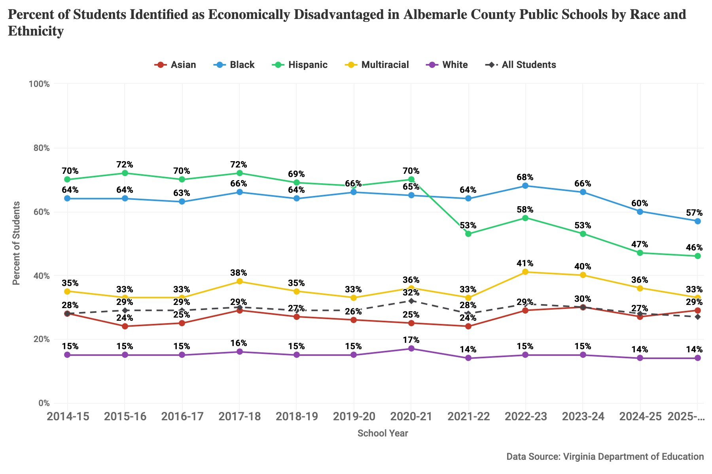
```

#### Charlottesville City Schools
```{r}
#| label: fig-cville-econ-disadv-img
#| fig-cap: "Percent of students identified as economically disadvantaged by race and ethnicity for the 20014-15 through 2025-26 school years in CCS."

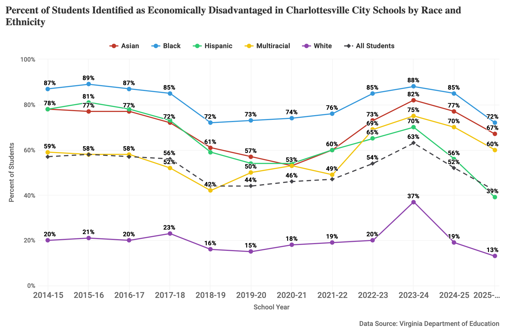
```

#### Virginia Public Schools
```{r}
#| label: fig-va-econ-disadv-img
#| fig-cap: "Percent of students identified as economically disadvantaged by race and ethnicity for the 20014-15 through 2025-26 school years in Virginia public schools."

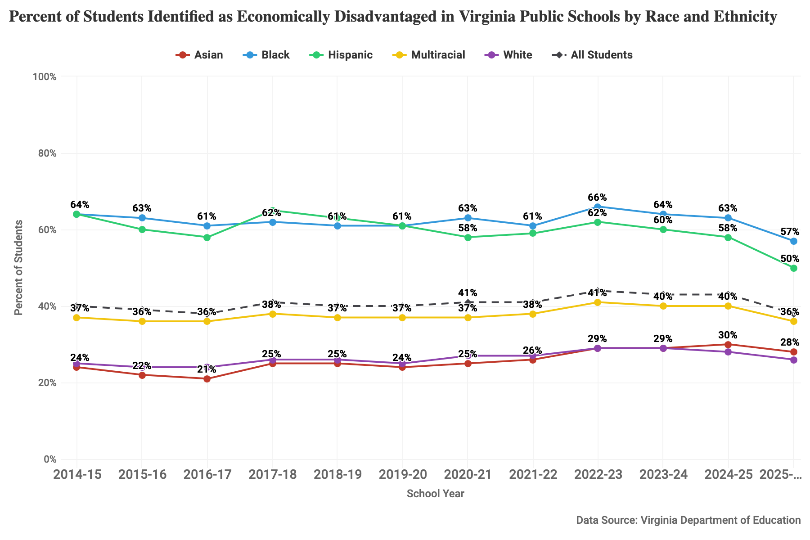
```
:::

### Assessments and Investigations by Child Protective Services

::: {.content-visible when-format="html"}
```{r, results='asis'}
df <- read_csv("../data/welfare_cases_race_ethn.csv") %>% 
  filter(! group %in% c("aian", "nhpi")) %>% 
  mutate(group = str_to_title(group)) %>% 
  filter(sfy_year >= 2016) %>% 
  filter(sfy_year <= 2024)
  
df$percent <- round(df$cps_rate_bygroup,1)
df$label <- df$group 
# df$count_label <- prettyNum(df$low_birth_weight_births, big.mark = ",")

title <- "Referrals to Child Protective Services Accepted for Assessment or Investigation"
ytext <- "Rate per 1,000 Children"
xtext <- "Fiscal Year (July 1st - June 30th)"
xlabels <- JS("function() { return this.value; }")
source_text <- "Data Source: Virginia Department of Social Services"

nms <- unique(df$local_agency)
len <- length(unique(df$local_agency))

mychart <- function(i) {
  df_groups <- df %>% filter(group != "All")
  df_all <- df %>% filter(group == "All")
  
  df_groups %>%
    filter(df_groups$local_agency == nms[[i]]) %>%
    hchart("line", hcaes(y = percent, x = sfy_year, group = label)) %>%
    hc_legend(align = "center", verticalAlign = "top") %>%
    hc_xAxis(title = list(text = xtext),
             labels = list(formatter = xlabels, style = list(fontSize = '1.2em')),
             tickInterval = 1,
             allowDecimals = FALSE) %>%
    hc_yAxis(min = 0, max = 220,
             title = list(text = ytext),
             labels = list(format = '{text}')) %>%
  hc_colors(c("#c0392b", "#3498db", "#2ecc71", "#8e44ad", "#434348")) %>%
  hc_plotOptions(series = list(dataLabels = list(format = '{y: f}', enabled = TRUE)),
                 line = list( marker = list(enabled = TRUE, symbol = list("circle")) )) %>%
  hc_tooltip(formatter = JS("function(){
  return this.series.name + '</br><b>' + this.key + '</b></br>' + 'Rate per 1,000: <b>' + this.y + '</b></br>'
  }")) %>%
  hc_title(text = paste0(title, " in ", nms[[i]], " by Race and Ethnicity"),
           align = 'left') %>%
  hc_caption(text = source_text,
             align = "right",
             style = list(fontSize = '1em')) %>%
  hc_add_theme(hc_theme_smpl()) %>%
  hc_add_series(data =  df_all %>% filter(df_all$local_agency == nms[[i]]), type = "line", mapping = hcaes(x = sfy_year, y = percent, group = label), dashStyle = "dash", marker = list(symbol = "diamond")) %>%
  hc_exporting(enabled=TRUE,
               sourceWidth = 900,
               sourceHeight = 600)
}

for (i in 1:len) {
  cat("####", nms[i], "\n \n")
  print(htmltools::tagList(mychart(i)))
}

```
:::

::: {.content-hidden when-format="html"}
#### Albemarle County
```{r}
#| label: fig-alb-cps-img
#| fig-cap: "Referrals to child protective services accepted for assessment or investigation by race and ethnicity, rate per 1,000 children, for fiscal years 2016-2024 for Albemarle County."

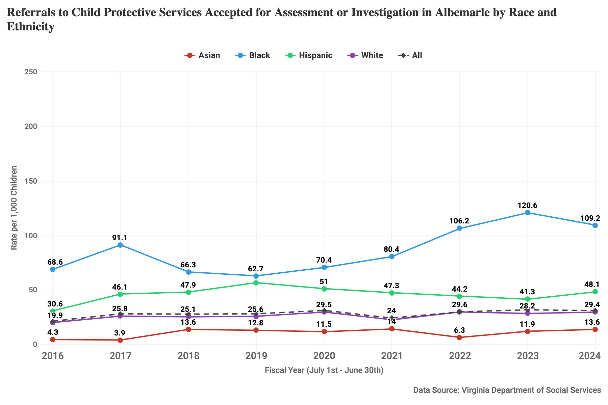
```

#### Charlottesville City
```{r}
#| label: fig-cville-cps-img
#| fig-cap: "Referrals to child protective services accepted for assessment or investigation by race and ethnicity, rate per 1,000 children, for fiscal years 2016-2024 for Charlottesville City."

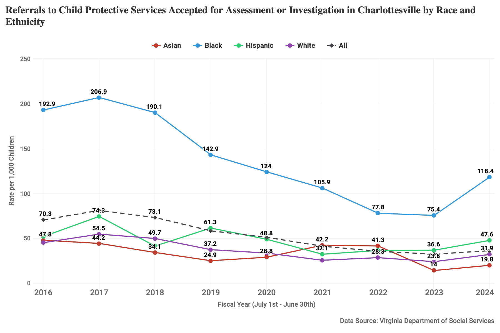
```

#### Virginia
```{r}
#| label: fig-va-cps-img
#| fig-cap: "Referrals to child protective services accepted for assessment or investigation by race and ethnicity, rate per 1,000 children, for fiscal years 2016-2024 for Virginia."

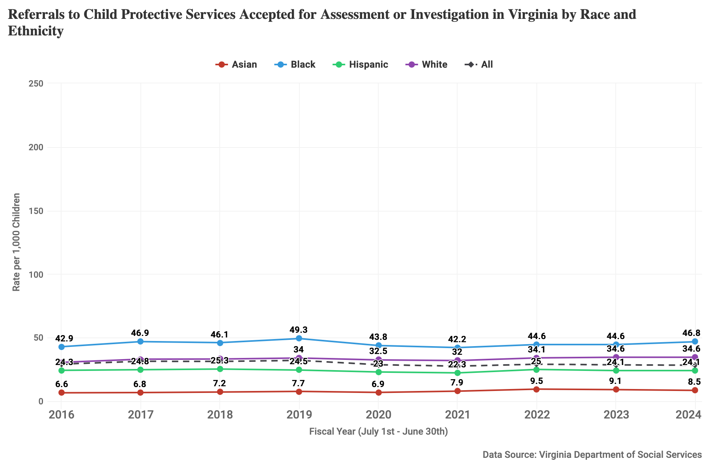
```
:::

### Children in Foster Care

::: {.content-visible when-format="html"}
```{r, results='asis'}
df <- read_csv("../data/foster_care_race_ethn.csv") %>% 
  mutate(group = str_to_title(group)) %>% 
  filter(year >= 2016) %>% 
  filter(year <= 2024)
  
df$percent <- round(df$fc_rate_bygroup,1)
df$label <- df$group 
# df$count_label <- prettyNum(df$low_birth_weight_births, big.mark = ",")

title <- "Rate of Children in Foster Care"
ytext <- "Rate per 1,000 Children"
xtext <- "Year (Measured on October 1st)"
xlabels <- JS("function() { return this.value; }")
source_text <- "Data Source: Virginia Department of Social Services"

nms <- unique(df$locality)
len <- length(unique(df$locality))

mychart <- function(i) {
  df_groups <- df %>% filter(group != "All")
  df_all <- df %>% filter(group == "All")
  
  df_groups %>%
    filter(df_groups$locality == nms[[i]]) %>%
    hchart("line", hcaes(y = percent, x = year, group = label)) %>%
    hc_legend(align = "center", verticalAlign = "top") %>%
    hc_xAxis(title = list(text = xtext),
             labels = list(formatter = xlabels, style = list(fontSize = '1.2em')),
             tickInterval = 1,
             allowDecimals = FALSE) %>%
    hc_yAxis(min = 0, max = 75,
             title = list(text = ytext),
             labels = list(format = '{text}')) %>%
    # hc_colors(c("#d7191c", "#fdae61", "#abdda4", "#2b83ba", "#dd74f1", "#000")) %>% 
  hc_colors(six_pal) %>%
  hc_plotOptions(series = list(dataLabels = list(format = '{y: f}', enabled = TRUE)),
                 line = list( marker = list(enabled = TRUE, symbol = list("circle")) )) %>%
  hc_tooltip(formatter = JS("function(){
  return this.series.name + '</br><b>' + this.key + '</b></br>' + 'Rate per 1,000: <b>' + this.y + '</b></br>'
  }")) %>%
  hc_title(text = paste0(title, " in ", nms[[i]], " by Race and Ethnicity"),
           align = 'left') %>%
  hc_caption(text = source_text,
             align = "right",
             style = list(fontSize = '1em')) %>%
  hc_add_theme(hc_theme_smpl()) %>%
  hc_add_series(data =  df_all %>% filter(df_all$locality == nms[[i]]), type = "line", mapping = hcaes(x = year, y = percent, group = label), dashStyle = "dash", marker = list(symbol = "diamond")) %>%
  hc_exporting(enabled=TRUE,
               sourceWidth = 900,
               sourceHeight = 600)
}

for (i in 1:len) {
  cat("####", nms[i], "\n \n")
  print(htmltools::tagList(mychart(i)))
}

```
:::

::: {.content-hidden when-format="html"}
#### Albemarle County
```{r}
#| label: fig-alb-foster-care-img
#| fig-cap: "Children in foster care by race and ethnicity, rate per 1,000 children in Albemarle County for 2016-2024, measured in October of each year."

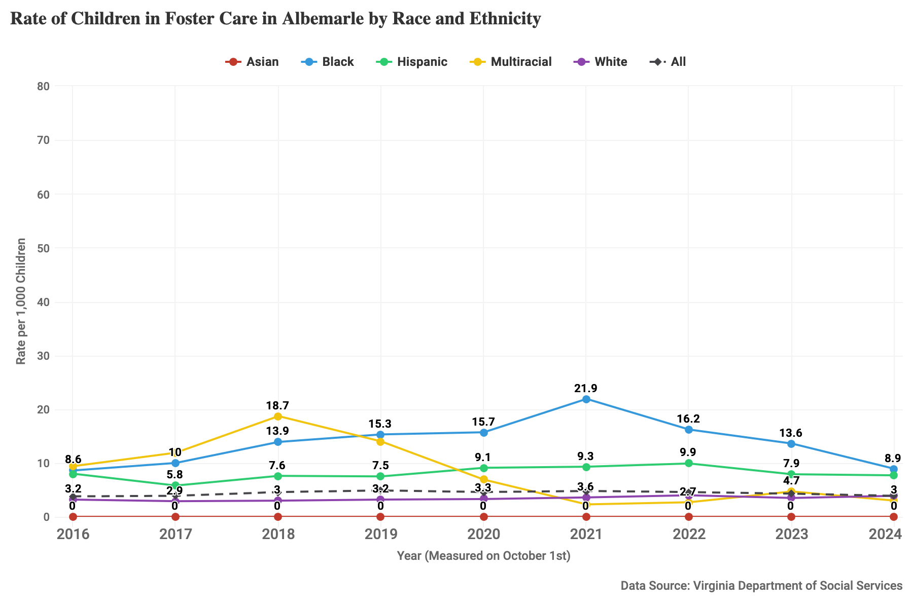
```

#### Charlottesville City
```{r}
#| label: fig-cville-foster-care-img
#| fig-cap: "Children in foster care by race and ethnicity, rate per 1,000 children in Charlottesville City for 2016-2024, measured in October of each year."

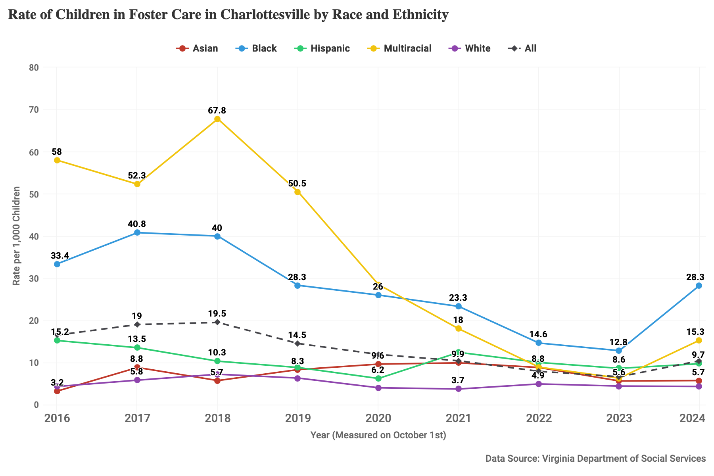
```

#### Virginia
```{r}
#| label: fig-va-foster-care-img
#| fig-cap: "Children in foster care by race and ethnicity, rate per 1,000 children in Virginia for 2016-2024, measured in October of each year."

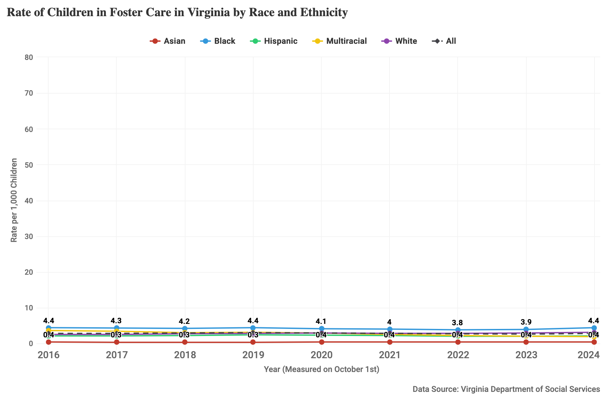
```
:::

## Health

### Low Birth-Weight Infants

::: {.content-visible when-format="html"}
```{r, results='asis'}

df <- read_csv("../data/low_birthweight_race_ethn.csv") %>% 
  filter(! maternal_race_and_ethnicity %in% c("American Indian or Alaskan Native", "Another Race, Non-Hispanic", "Asian or Pacific Islander", "Unknown Race and Ethnicity")) %>% 
  mutate(group = case_when(maternal_race_and_ethnicity == "Black or African American" ~ "Black",
                           maternal_race_and_ethnicity == "Hispanic or Latinx (All Races)" ~ "Hispanic",
                           .default = maternal_race_and_ethnicity)) %>% 
  filter(year >= 2014) %>% 
  mutate(across(low_birth_weight_births:percentage_with_low_birth_weight, ~ as.numeric(.x))) %>% 
  mutate(location = case_when(str_detect(geography, "Albemarle") ~ "Albemarle",
                              str_detect(geography, "Charlottesville") ~ "Charlottesville",
                              str_detect(geography, "Virginia") ~ "Virginia"),
         count = ifelse(is.na(low_birth_weight_births), 1, low_birth_weight_births),
         percent = round(count/total_live_births *100, 0)) %>% 
  select(year, location, group, percent)

df_all <- read_csv("../data/low_birthweight.csv") %>% 
  mutate(group = "All Births") %>%
  rename("year" = "time_frame",
         "percent" = "percent_low_birthweight") %>% 
  select(year, location, group, percent)

df <- rbind(df, df_all)

df <- df %>% 
  filter(year >= 2014) %>% 
  arrange(location)
  
df$percent <- round(df$percent,0)
df$label <- df$group 
# df$count_label <- prettyNum(df$low_birth_weight_births, big.mark = ",")

title <- "Percent Low Birth-Weight Babies"
ytext <- "Percent of Births"
xtext <- "Year"
xlabels <- JS("function() { return this.value; }")
source_text <- "Data Source: Virginia Department of Health, Maternal & Child Health Epidemiology Unit"

nms <- unique(df$location)
len <- length(unique(df$location))

mychart <- function(i) {
  df_groups <- df %>% filter(group != "All Births")
  df_all <- df %>% filter(group == "All Births")
  
  df_groups %>%
    filter(df_groups$location == nms[[i]]) %>%
    hchart("line", hcaes(y = percent, x = year, group = label)) %>%
    hc_legend(align = "center", verticalAlign = "top") %>%
    hc_xAxis(title = list(text = xtext),
             labels = list(formatter = xlabels, style = list(fontSize = '1.2em')),
             tickInterval = 1,
             allowDecimals = FALSE) %>%
    hc_yAxis(min = 0, max = 100,
             title = list(text = ytext),
             labels = list(format = '{text}%')) %>%
  hc_colors(c("#3498db", "#2ecc71", "#8e44ad", "#434348")) %>%
  hc_plotOptions(series = list(dataLabels = list(format = '{y: f}%', enabled = TRUE)),
                 line = list( marker = list(enabled = TRUE, symbol = list("circle")) )) %>%
  hc_tooltip(formatter = JS("function(){
  return this.series.name + '</br><b>' + this.key + '</b></br>' + 'Percent: <b>' + this.y + '%</b></br>'
  }")) %>%
  hc_title(text = paste0(title, " in ", nms[[i]], " by Race and Ethnicity"),
           align = 'left') %>%
  hc_caption(text = source_text,
             align = "right",
             style = list(fontSize = '1em')) %>%
  hc_add_theme(hc_theme_smpl()) %>%
  hc_add_series(data =  df_all %>% filter(df_all$location == nms[[i]]), type = "line", mapping = hcaes(x = year, y = percent, group = label), dashStyle = "dash", marker = list(symbol = "diamond")) %>%
  hc_exporting(enabled=TRUE,
               sourceWidth = 900,
               sourceHeight = 600)
}

for (i in 1:len) {
  cat("####", nms[i], "\n \n")
  print(htmltools::tagList(mychart(i)))
}

```
:::

::: {.content-hidden when-format="html"}
#### Albemarle County
```{r}
#| label: fig-alb-low-birthweight-img
#| fig-cap: "Percent of babies born weighing under 2,500 grams (5.5 lbs) by race and ethnicity, 2014-2024, for Albemarle County."

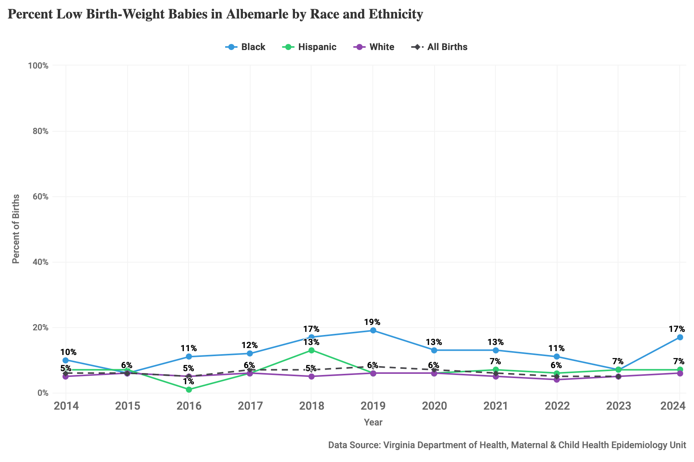
```

#### Charlottesville City
```{r}
#| label: fig-cville-low-birthweight-img
#| fig-cap: "Percent of babies born weighing under 2,500 grams (5.5 lbs) by race and ethnicity, 2014-2024, for Charlottesville City."

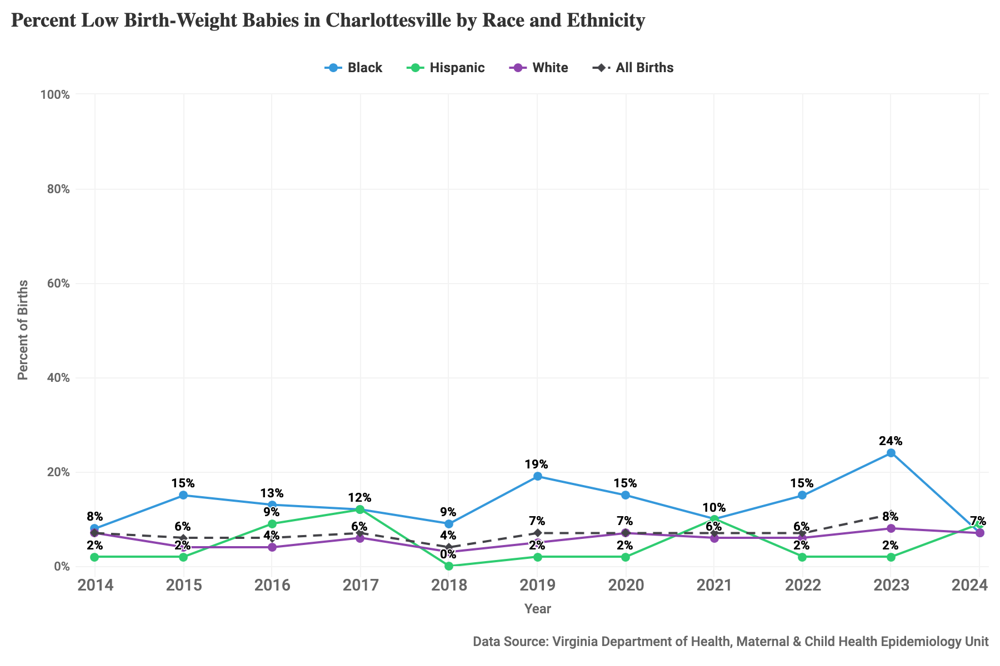
```

#### Virginia
```{r}
#| label: fig-va-low-birthweight-img
#| fig-cap: "Percent of babies born weighing under 2,500 grams (5.5 lbs) by race and ethnicity, 2014-2024, for Virginia."

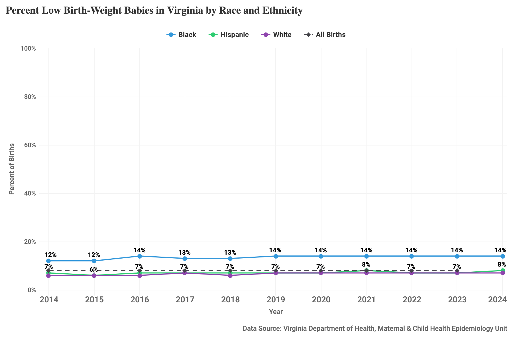
```
:::

### Infant Mortality

::: {.content-visible when-format="html"}
```{r, results='asis'}
df <- read_csv("../data/infant_mortality_race_ethn.csv") %>% 
  filter(! maternal_race_and_ethnicity %in% c("American Indian or Alaskan Native", "Another Race, Non-Hispanic", "Asian or Pacific Islander", "Unknown Race and Ethnicity")) %>% 
  mutate(group = case_when(maternal_race_and_ethnicity == "Black or African American" ~ "Black",
                           maternal_race_and_ethnicity == "Hispanic or Latinx (All Races)" ~ "Hispanic",
                           .default = maternal_race_and_ethnicity)) %>% 
  mutate(across(infant_deaths:infant_mortality_rate, ~ as.numeric(.x))) %>% 
  mutate(location = case_when(str_detect(geography, "Albemarle") ~ "Albemarle",
                              str_detect(geography, "Charlottesville") ~ "Charlottesville",
                              str_detect(geography, "Virginia") ~ "Virginia"),
         count = ifelse(is.na(infant_deaths), 1, infant_deaths),
         rate = round(count/total_live_births *1000, 0)) %>% 
  select(year, location, group, rate)

df <- df %>% 
  arrange(location, year) %>% 
  group_by(location, group) %>% 
  mutate(rate_infant_mortality_3yravg = zoo::rollmean(rate, k = 3, fill = NA, align = "center")) %>% 
  ungroup()

df_all <- read_csv("../data/infant_mortality.csv") %>% 
  mutate(group = "All Births") %>%
  rename("year" = "time_frame",
         "rate" = "rate_infant_mortality") %>% 
  select(year, location, group, rate, rate_infant_mortality_3yravg)

df <- rbind(df, df_all)

df <- df %>% 
  filter(year >= 2016) %>% 
  filter(year <= 2023)
  
df$percent <- round(df$rate_infant_mortality_3yravg,1)
df$label <- df$group 
# df$count_label <- prettyNum(df$low_birth_weight_births, big.mark = ",")

title <- "Infant Mortality Rate"
ytext <- "Rate per 1,000 births"
xtext <- "Year (3 Year Rolling Average)"
xlabels <- JS("function() { return this.value; }")
source_text <- "Data Source: Virginia Department of Health, Maternal & Child Health Epidemiology Unit"

nms <- unique(df$location)
len <- length(unique(df$location))

mychart <- function(i) {
  df_groups <- df %>% filter(group != "All Births")
  df_all <- df %>% filter(group == "All Births")
  
  df_groups %>%
    filter(df_groups$location == nms[[i]]) %>%
    hchart("line", hcaes(y = percent, x = year, group = label)) %>%
    hc_legend(align = "center", verticalAlign = "top") %>%
    hc_xAxis(title = list(text = xtext),
             labels = list(formatter = xlabels, style = list(fontSize = '1.2em')),
             tickInterval = 1,
             allowDecimals = FALSE) %>%
    hc_yAxis(min = 0, max = 50,
             title = list(text = ytext),
             labels = list(format = '{text}')) %>%
  hc_colors(c("#3498db", "#2ecc71", "#8e44ad", "#434348")) %>%
  hc_plotOptions(series = list(dataLabels = list(format = '{y: f}', enabled = TRUE)),
                 line = list( marker = list(enabled = TRUE, symbol = list("circle")) )) %>%
  hc_tooltip(formatter = JS("function(){
  return this.series.name + '</br><b>' + this.key + '</b></br>' + 'Rate per 1,000 Births: <b>' + this.y + '</b></br>'
  }")) %>%
  hc_title(text = paste0(title, " in ", nms[[i]], " by Race and Ethnicity"),
           align = 'left') %>%
  hc_caption(text = source_text,
             align = "right",
             style = list(fontSize = '1em')) %>%
  hc_add_theme(hc_theme_smpl()) %>%
  hc_add_series(data =  df_all %>% filter(df_all$location == nms[[i]]), type = "line", mapping = hcaes(x = year, y = percent, group = label), dashStyle = "dash", marker = list(symbol = "diamond")) %>%
  hc_exporting(enabled=TRUE,
               sourceWidth = 900,
               sourceHeight = 600)
}

for (i in 1:len) {
  cat("####", nms[i], "\n \n")
  print(htmltools::tagList(mychart(i)))
}

```
:::

::: {.content-hidden when-format="html"}
#### Albemarle County
```{r}
#| label: fig-alb-infant-mortality-img
#| fig-cap: "Rate per 1,000 births of infants who died before their 1st birthday by race and ethnicity, 2016-2023, for Albemarle."

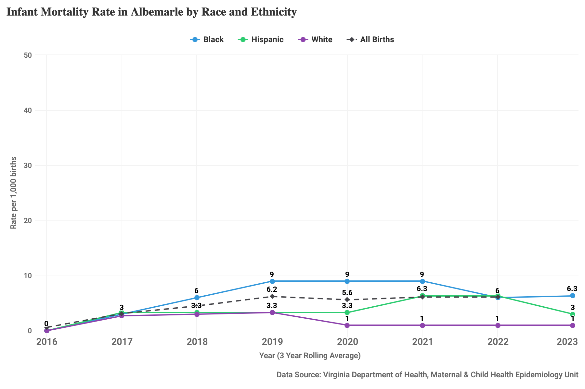
```

#### Charlottesville City
```{r}
#| label: fig-cville-infant-mortality-img
#| fig-cap: "Rate per 1,000 births of infants who died before their 1st birthday by race and ethnicity, 2016-2023, for Charlottesville City."

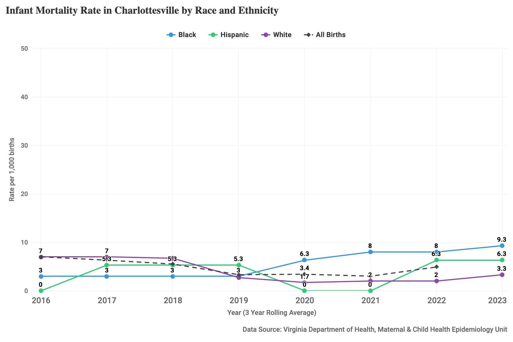
```

#### Virginia
```{r}
#| label: fig-va-infant-mortality-img
#| fig-cap: "Rate per 1,000 births of infants who died before their 1st birthday by race and ethnicity, 2016-2023, for Virginia."

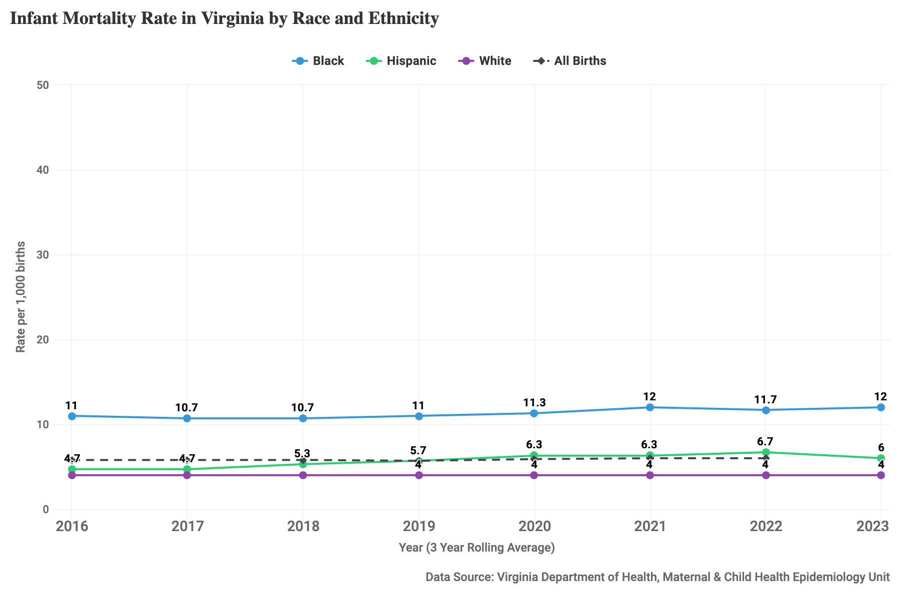
```
:::
